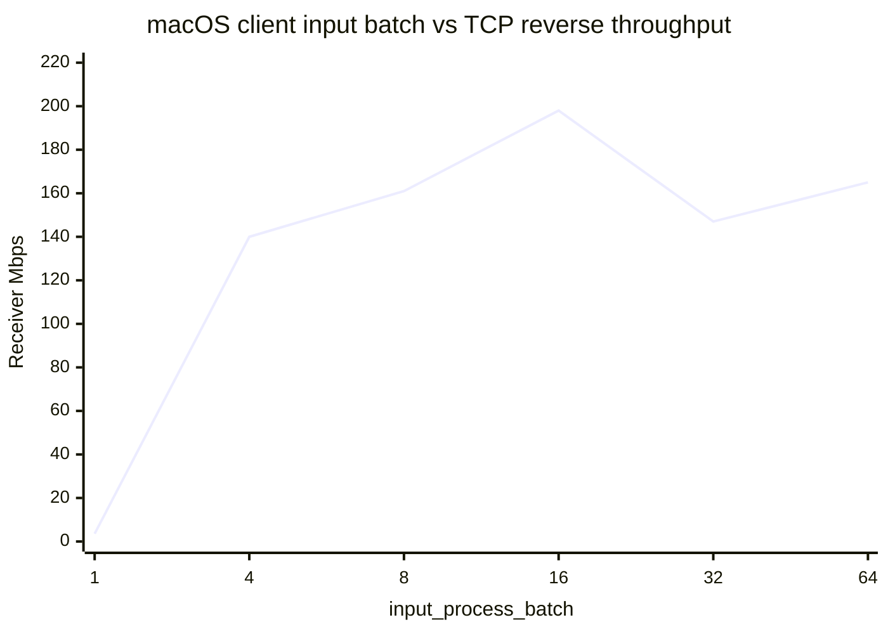

# Autobricks VPN 성능 측정 기록


성능 변경은 아래에 날짜별로 누적합니다. 이후 최적화에서도 기존 결과를 덮어쓰지 않고 새 날짜의 항목을 추가합니다. 비교 시에는 측정 장비, 경로, build profile, packet 크기, 방향과 반복 횟수를 함께 기록합니다.

모든 신규 성능 측정에는 다음 조건을 반드시 함께 남깁니다. 하나라도 확인하지 못한 항목은 추정하지 않고 `미기록`으로 표시하며, 조건이 다른 결과끼리는 직접적인 성능 향상·회귀로 단정하지 않습니다.

- 측정 날짜·시간대와 client/server 장비 및 운영체제
- client/server commit 또는 source 상태와 실행 binary/library SHA-256
- client/server build profile, feature와 wolfSSL version
- VPN endpoint, 방향, MTU, packet/payload 크기와 수신 처리 구조
- TUN/UDP drain·process batch, queue 용량과 TTL
- 측정 명령, protocol, stream 수, 측정 시간, warm-up 제외 시간과 반복 횟수
- 각 반복의 개별값, 평균 또는 중앙값, TCP retransmission이나 UDP loss/jitter
- 동일 시점 WireGuard 또는 직접 경로 비교값
- 측정 전후 서비스 상태와 임시 process/firewall 정리 여부

재현 가능한 기록은 다음 형식을 사용합니다.

```text
Date/time:
Client: OS / CPU / commit / build profile / binary SHA-256 / wolfSSL
Server: OS / CPU / commit / build profile / library SHA-256 / wolfSSL
Path: endpoint / direction / MTU / receive architecture
Tuning: TUN drain/process / UDP drain/process / queue capacity/TTL
Command: exact iperf3 or copy command
Runs: individual results including retransmission/loss/jitter
Reference: same-window WireGuard/direct result
Cleanup: client/iperf/firewall/service status
```

### 2026-09-18 - 초기 상태 회고

초기 개발 빌드는 같은 Ubuntu 서버의 WireGuard 경로와 비교했을 때 파일 전송이 약 3배 느렸습니다. 이는 2026-09-18에 기록한 개발 과정의 회고값이며 당시의 정밀한 원시 측정 로그는 남아 있지 않습니다. 이후 release 빌드, TUN non-blocking 처리, OS별 I/O 분리, 세션 HashMap 인덱스, 제한된 송신 대기 queue와 Linux ICMP Redirect 차단을 적용했습니다.

### 2026-09-18 - 공통 측정 환경

- 클라이언트: Apple Silicon MacBook Air, macOS 14
- 서버: `10.10.254.1`, Ubuntu 22.04, Linux `6.8.0-136-generic`, x86_64, 12 CPU
- Autobricks VPN: client `10.8.1.2`, server `10.8.1.1`, configured UDP endpoint, DTLS 1.3, MTU 1350
- WireGuard: 동일 클라이언트에서 동일 서버의 `10.10.254.1` 사용
- Autobricks 서버: release build, wolfSSL 5.9.1 계열 `libwolfssl.so.44`
- `iperf3`: macOS 3.21.1, Ubuntu 3.9

### 2026-09-18 - Ping RTT

| 단계 | 대상 | 표본 | 평균 RTT | 최소 | 최대 | 손실 |
|---|---|---:|---:|---:|---:|---:|
| HashMap/queue 변경 전 | Autobricks `10.8.1.1` | 29 | 16.33 ms | 8.588 ms | 25.216 ms | 0% |
| 변경 직후 첫 측정 | Autobricks `10.8.1.1` | 13 | 18.44 ms | 11.477 ms | 27.280 ms | 0% |
| 변경 후 안정화 측정 | Autobricks `10.8.1.1` | 24 | 13.01 ms | 7.547 ms | 20.588 ms | 0% |
| 비교 측정 | WireGuard `10.10.254.1` | 30 | 14.25 ms | 8.739 ms | 18.954 ms | 0% |

안정화 측정의 Autobricks 평균 RTT는 WireGuard와 유사했습니다. 작은 ICMP 패킷의 RTT는 인터넷·Wi-Fi jitter 영향을 크게 받으므로 터널 처리량 판단에는 SCP와 `iperf3` 결과를 함께 사용합니다.

### 2026-09-18 - SCP 128 MiB 1차 측정

SSH 압축을 비활성화하고 각 경로를 3회 교차 측정했습니다. 업로드와 다운로드 후 모든 파일의 크기와 SHA-256이 원본과 일치했습니다.

| 방향 | Autobricks 개별 시간 | Autobricks 평균 | WireGuard 개별 시간 | WireGuard 평균 |
|---|---|---:|---|---:|
| macOS → 서버 | 4.95 / 5.07 / 5.16초 | 5.06초, 약 202 Mbps | 4.51 / 4.11 / 3.70초 | 4.11초, 약 249 Mbps |
| 서버 → macOS | 4.51 / 4.56 / 4.62초 | 4.56초, 약 224 Mbps | 4.71 / 4.35 / 4.33초 | 4.46초, 약 229 Mbps |

1차 측정에서 다운로드는 약 2% 차이였고 업로드는 WireGuard가 약 23% 높았습니다.

### 2026-09-18 - SCP 실행 순서 반전

1차 테스트의 순서 편향을 확인하기 위해 `WireGuard → Autobricks` 순서로 3회 반복했습니다. 파일 크기와 SHA-256은 모두 일치했습니다.

| 경로 | 개별 업로드 시간 | 평균 시간 | 환산 처리량 |
|---|---|---:|---:|
| WireGuard | 3.85 / 3.89 / 3.94초 | 3.89초 | 약 263 Mbps |
| Autobricks | 6.04 / 6.41 / 5.08초 | 5.84초 | 약 175 Mbps |

두 SCP 업로드 테스트를 합친 6회 평균은 WireGuard 4.00초, 약 256 Mbps이고 Autobricks 5.45초, 약 188 Mbps입니다. 순서를 반대로 해도 WireGuard 업로드가 빨랐으므로 첫 결과는 단순한 warm-up 순서 효과가 아니었습니다.

### 2026-09-18 - iperf3 TCP 단일 스트림

각 방향을 15초 측정하고 초기 2초를 제외했습니다.

| 방향 | Autobricks | WireGuard | Autobricks TCP 재전송 | WireGuard TCP 재전송 |
|---|---:|---:|---:|---:|
| macOS → 서버 | 244.7 Mbps | 294.7 Mbps | 126 | 5 |
| 서버 → macOS | 271.3 Mbps | 248.6 Mbps | 567 | 1,730 |

단일 스트림 업로드는 Autobricks가 약 17% 낮았고 다운로드는 약 9% 높았습니다.

### 2026-09-18 - iperf3 TCP 4병렬 스트림

각 방향을 10초 측정하고 초기 2초를 제외했습니다.

| 방향 | Autobricks | WireGuard |
|---|---:|---:|
| macOS → 서버 | 247.1 Mbps | 289.3 Mbps |
| 서버 → macOS | 307.3 Mbps | 303.0 Mbps |

Autobricks 업로드에서 한 차례 121.4 Mbps가 측정됐지만 즉시 재측정하면 247.1 Mbps로 회복되어 일시적인 외부 경로 변동으로 분류했습니다. 247 Mbps 업로드 중 `vpn-server` CPU는 단일 코어 기준 약 40~75%였습니다.

### 2026-09-18 - iperf3 UDP 250 Mbps

내부 MTU에서 IP fragmentation을 피하기 위해 UDP payload를 1,200바이트로 지정하고 각 방향을 10초 측정했습니다.

| 방향 | 경로 | 처리량 | 손실 | Jitter |
|---|---|---:|---:|---:|
| macOS → 서버 | Autobricks | 250.0 Mbps | 0.109% | 0.028 ms |
| macOS → 서버 | WireGuard | 250.0 Mbps | 0.364% | 0.041 ms |
| 서버 → macOS | Autobricks | 250.0 Mbps | 0% | 0.067 ms |
| 서버 → macOS | WireGuard | 250.0 Mbps | 0% | 0.163 ms |

250 Mbps에서는 두 VPN 모두 목표 처리량을 전달했고 Autobricks의 손실률과 jitter가 낮았습니다.

### 2026-09-18 - iperf3 UDP 350 Mbps 한계 측정

macOS에서 서버 방향으로 1,200바이트 UDP payload를 10초 전송했습니다.

| 경로 | 송신률 | 손실 | Jitter |
|---|---:|---:|---:|
| Autobricks | 350.8 Mbps | 5.80% | 0.010 ms |
| WireGuard | 350.0 Mbps | 12.95% | 0.018 ms |

350 Mbps에서는 두 경로 모두 손실이 발생해 물리 네트워크 한계에 진입했습니다. Autobricks `vpn-server` CPU는 활성 구간에서 단일 코어 기준 약 56~74%였으므로 서버 CPU 100% 포화가 직접 한계는 아니었습니다.

### 2026-09-18 - 결과와 다음 비교 항목

- Ping RTT와 TCP 다운로드는 WireGuard와 동급입니다.
- TCP 업로드는 Autobricks가 대략 15~17% 낮았습니다.
- UDP 250 Mbps에서는 Autobricks가 WireGuard보다 낮은 손실률과 jitter를 보였습니다.
- 350 Mbps UDP에서는 두 경로 모두 물리 경로 한계로 손실이 증가했습니다.
- 다음 최적화 비교에서는 map 전체 재구성 제거, client `WouldBlock` queue, 조건부 `POLLOUT`, queue/drop 계측과 macOS TUN copy 축소의 효과를 각각 분리해 측정합니다.
- 테스트용 `iperf3` daemon과 임시 firewall rule은 측정 직후 제거했습니다.

### 2026-09-18 - client 송신 queue 적용 후 재측정

macOS release client에 UDP `WouldBlock` 시 packet을 버리지 않는 bounded queue를 적용한 뒤 같은 `10.8.1.2 -> 10.8.1.1` 경로에서 다시 측정했습니다. queue는 최대 256 packet, TTL 2초, loop당 최대 32 packet을 전송하며, queue가 비어 있지 않을 때만 UDP `POLLOUT`을 감시합니다.

| 항목 | 방향 | 결과 |
|---|---|---:|
| TCP 4병렬, 8초, 3회 평균 | macOS → 서버 | 245.0 Mbps |
| TCP 4병렬, 8초, 3회 평균 | 서버 → macOS | 293.7 Mbps |
| TCP 단일, 8초, 3회 평균 | macOS → 서버 | 277.7 Mbps |
| TCP 단일, 8초, 1회 | 서버 → macOS | 266 Mbps |
| UDP 250 Mbps, 10초 | macOS → 서버 | 0.19% loss, 0.032 ms jitter |
| UDP 250 Mbps, 10초 | 서버 → macOS | 0% loss, 0.093 ms jitter |
| UDP 350 Mbps, 10초, 1차 | macOS → 서버 | 15% loss, 0.014 ms jitter |
| UDP 350 Mbps, 10초, 2차 | macOS → 서버 | 0.27% loss, 0.059 ms jitter |
| UDP 350 Mbps, 10초, 1차 | 서버 → macOS | 19% loss, 0.032 ms jitter |
| UDP 350 Mbps, 10초, 2차 | 서버 → macOS | 19% loss, 0.039 ms jitter |

TCP 4병렬 결과는 queue 적용 전의 정방향 247.1 Mbps, 역방향 307.3 Mbps와 같은 범위이므로 이번 변경만으로 TCP 처리량 향상이 확인되지는 않았습니다. UDP 250 Mbps는 계속 안정적이지만 350 Mbps 정방향은 측정 간 편차가 크고, 역방향은 약 19% 손실이 반복됐습니다. client 송신 queue는 주로 macOS → 서버 방향의 순간적인 UDP socket backpressure를 보호하므로 서버 → macOS 손실은 해결하지 못합니다. 다음 분석에서는 client의 DTLS read와 TUN write 처리량, 수신 socket buffer, 한 번의 readiness당 처리하는 datagram 수와 queue 통계를 함께 계측해야 합니다.

TCP 부하와 동시에 실시한 ping 20회는 손실 0%, 평균 26.707 ms, 최대 122.009 ms였습니다. 유휴 상태의 이전 평균 13.01 ms보다 지연과 편차가 증가했으므로 처리량뿐 아니라 부하 중 latency도 계속 비교합니다. 테스트 종료 후 `iperf3` daemon과 임시 TCP/UDP 5201 firewall rule을 제거했으며 VPN 서비스는 `active`, 재시작 횟수는 0이었습니다.

### 2026-09-18 - server/client batch drain 비교

클라이언트의 TUN 및 DTLS 입력과 서버의 TUN 입력은 wakeup당 최대 64 packet을 처리하고 있었습니다. 남아 있던 서버 UDP 단일 수신을 bounded batch로 변경한 뒤 batch 크기와 서버 `POLLOUT` 감시를 분리해 A/B 측정했습니다.

- 서버 UDP batch 64와 조건부 `POLLOUT`: TCP 4병렬 정방향 평균 308 Mbps, 역방향 안정 구간 약 217 Mbps였습니다. 첫 역방향 측정은 19.5 Mbps까지 하락했습니다.
- 서버 `POLLOUT` 제거, UDP batch 64: 역방향 206/226/230 Mbps였고 정방향은 94/126/193 Mbps로 측정 간 편차가 컸습니다. 따라서 `POLLOUT` 하나만이 회귀 원인은 아니었습니다.
- 서버 UDP batch 16, TUN batch 64, 서버 `POLLOUT` 비활성화를 최종값으로 선택했습니다. UDP ACK burst가 TUN 송신을 오래 점유하지 않도록 UDP 쪽의 batch를 더 작게 제한했습니다.

최종 상태에서 같은 wildcard `iperf3` server를 사용하고 매 측정마다 Autobricks와 WireGuard 순서로 교차 실행했습니다.

| 프로토콜/부하            | 방향         |         Autobricks |          WireGuard |                    비교 |
| ------------------ | ---------- | -----------------: | -----------------: | --------------------: |
| TCP 4병렬, 8초, 2회 평균 | macOS → 서버 |         344.5 Mbps |         304.0 Mbps |     Autobricks +13.3% |
| TCP 4병렬, 8초, 2회 평균 | 서버 → macOS |         247.5 Mbps |         291.0 Mbps |     Autobricks -14.9% |
| UDP 250 Mbps, 10초  | macOS → 서버 |         0.38% loss |        0.067% loss |       둘 다 249 Mbps 수신 |
| UDP 250 Mbps, 10초  | 서버 → macOS |            0% loss |            0% loss |       둘 다 250 Mbps 수신 |
| UDP 350 Mbps, 10초  | macOS → 서버 |         0.38% loss |        0.069% loss | 둘 다 약 348~349 Mbps 수신 |
| UDP 350 Mbps, 10초  | 서버 → macOS | 19% loss, 283 Mbps | 11% loss, 310 Mbps |          WireGuard 우세 |

최종 유휴 ping 5회는 손실 0%, 평균 13.766 ms였습니다. 서버 UDP batch는 Autobricks의 정방향 TCP 처리량을 WireGuard 이상으로 높였지만, 서버 → macOS의 고부하 수신 경로는 계속 약 15% 낮은 TCP 처리량과 더 높은 UDP 손실을 보였습니다. 다음 최적화 대상은 macOS client의 UDP socket receive buffer, 한 번의 DTLS callback에서 소비되는 datagram 수, 복호화 후 TUN write의 backpressure와 copy 횟수입니다. 테스트 후 `iperf3` daemon과 Autobricks/WireGuard용 임시 TCP·UDP 5201 firewall rule 네 개를 모두 제거했으며 VPN 서비스는 `active`, 재시작 횟수는 0이었습니다.

### 2026-09-18 - 서버 packet-path 고정 메모리 적용 최종 측정

서버 UDP 수신을 1,024개의 사전 할당 datagram slot pool로 변경하고, 세션별 DTLS `WouldBlock` 송신 queue를 256개의 고정 slot ring으로 변경한 상태를 측정했습니다. 서버 release library SHA-256은 `290c236c0203e92aa8b6df4122b7c79c3bf937a9a496fa05ef88773e34b0377a`입니다. 측정 조건은 macOS `iperf3` 3.21.1과 Ubuntu `iperf3` 3.9, MTU 1350, UDP payload 1,200바이트이며 TCP/UDP 모두 초기 2초를 제외하고 8초 또는 10초 측정했습니다.

| 프로토콜/부하 | 방향 | Autobricks | WireGuard | 비교 |
|---|---|---:|---:|---:|
| TCP 단일, 8초 | macOS → 서버 | 284 Mbps | 316 Mbps | Autobricks -10.1% |
| TCP 4병렬, 8초 | macOS → 서버 | 305 Mbps | 260 Mbps | Autobricks +17.3% |
| TCP 단일, 8초 | 서버 → macOS | 156 Mbps, 재측정 180 Mbps | 274 Mbps | 재측정 기준 -34.3% |
| TCP 4병렬, 8초 | 서버 → macOS | 153 Mbps, 재측정 158 Mbps | 286 Mbps | 재측정 기준 -44.8% |
| UDP 250 Mbps, 10초 | macOS → 서버 | 246 Mbps 수신 | 250 Mbps, 0% loss | Autobricks -1.6% |
| UDP 250 Mbps, 10초 | 서버 → macOS | 245 Mbps, 0.11% loss | 250 Mbps, 0% loss | WireGuard 우세 |
| UDP 350 Mbps, 10초 | macOS → 서버 | 292 Mbps 수신 | 312 Mbps 수신 | WireGuard +6.8% |
| UDP 350 Mbps, 10초 | 서버 → macOS | 263 Mbps, 24% loss | 220 Mbps, 37% loss | Autobricks 수신률 우세 |

정방향 TCP는 단일 스트림에서 WireGuard보다 10.1% 낮았지만 4병렬에서는 17.3% 높아 서버의 UDP 수신 slot pool이 정방향 병목을 만들지는 않았습니다. 반면 서버 → macOS TCP는 두 번 측정해도 이전 batch-drain 측정의 247.5 Mbps보다 낮은 153~180 Mbps였습니다. 고정 메모리 적용으로 packet별 Rust heap allocation은 제거했지만, macOS client의 DTLS 수신·복호화·utun write 직렬 경로 또는 측정 시점의 네트워크 상태가 역방향 처리량을 제한했을 가능성이 있습니다. 이번 측정만으로 두 원인을 분리할 수 없으므로 회귀를 해결됐다고 판단하지 않습니다.

정방향 UDP에서는 macOS 3.21.1 client와 Ubuntu 3.9 server 조합이 수신 packet loss 개수를 `Unknown`으로 반환해 손실률을 임의 계산하지 않고 실제 수신 처리량만 기록했습니다. 역방향은 수신 측 macOS가 loss를 계산할 수 있어 해당 값을 기록했습니다. 측정 전 ping 10회는 손실 0%, 평균 15.324 ms였고 측정 후 ping 10회도 손실 0%, 평균 12.863 ms였습니다. 테스트 종료 후 `iperf3`와 임시 UFW 규칙 네 개를 제거했으며 `autobricks-vpn.service`는 `active`, `NRestarts=0` 상태를 유지했습니다.

### 2026-09-18 - macOS client input batch sweep

서버 batch와 코드는 유지하고 macOS client의 `input_process_batch`만 `1, 4, 8, 16, 32, 64`로 변경했습니다. 각 값마다 client를 완전히 종료하고 다시 DTLS handshake한 뒤, 동일한 서버 → macOS TCP 단일 스트림을 `iperf3 -R -t 5 -O 1`로 한 번 측정했습니다. client는 debug profile과 wolfSSL 5.9.1 DTLS 1.3 build를 사용했습니다.

| Client input batch | 수신 처리량 | 서버 TCP 재전송 |
|---:|---:|---:|
| 1 | 3.57 Mbps | 0 |
| 4 | 140 Mbps | 96 |
| 8 | 161 Mbps | 24 |
| 16 | 198 Mbps | 1 |
| 32 | 147 Mbps | 70 |
| 64 | 165 Mbps | 46 |



batch 1은 packet마다 event loop와 readiness 확인으로 돌아가면서 3.57 Mbps까지 하락했습니다. 4에서 16까지는 loop 왕복 비용을 분산하면서 처리량이 증가했고 16에서 198 Mbps와 재전송 1회로 가장 좋은 결과를 보였습니다. 32와 64에서는 한 방향을 오래 연속 처리하면서 반대 방향 TCP ACK 처리가 늦어질 수 있어 처리량과 재전송이 다시 나빠졌습니다. 다만 이 sweep은 당시의 2단계 queued receive 구조에서 얻은 1회 측정값입니다. 이후 client 중간 UDP queue를 제거하고 wolfSSL callback 직접 수신으로 되돌렸으므로 현재 구조의 최적값으로 그대로 해석하지 않습니다. 현재 기본값은 과거 직접 수신 경로와 같은 64이며 `AVPN_INPUT_PROCESS_BATCH` 환경 변수 또는 `client.ini`의 `input_process_batch`로 1~256 범위에서 덮어쓸 수 있습니다. 테스트 후 client, `iperf3`와 임시 UFW 규칙을 종료했고 서버 서비스는 `active`, `NRestarts=0`이었습니다.

같은 batch 16을 macOS release/DTLS 1.3 build로 다시 실행하고 이전 기록과 같은 `-R -t 8 -O 2` 조건으로 두 번 측정한 결과는 144/182 Mbps, 평균 163 Mbps였습니다. 동일 시점 WireGuard 단일 역방향은 279 Mbps였으므로 물리·Wi-Fi 경로 전체가 느려진 결과는 아닙니다. release 최적화만으로 처리량이 회복되지 않았으며, 이 측정 당시 client가 UDP socket을 고정 input queue로 먼저 비운 뒤 `DtlsIo`의 별도 고정 queue로 다시 복사해 wolfSSL이 소비하는 이중 queue 경로가 이전의 callback 직접 수신 경로와 다른 핵심 변수였습니다.

후속 M1 client 전용 A/B에서 중간 client UDP queue를 제거한 단일 `DtlsIo` ring은 batch 16에서 162/161 Mbps였고, ring까지 우회한 wolfSSL callback 직접 socket 수신은 batch 16에서 168/155 Mbps, batch 64에서 164/171 Mbps였습니다. 따라서 client queue와 해당 packet 복사는 회귀의 주원인이 아니었습니다. utun payload 복사를 `readv/writev`로 제거한 직접 수신 batch 64는 169/170 Mbps로 소폭 개선됐지만 이전 247.5 Mbps에는 미치지 못했습니다. 부하 중 M1 client CPU는 약 8~11%, RSS는 약 8.3 MiB로 CPU 포화도 아니었습니다. 이전 247.5 Mbps 측정 당시 서버 TUN 처리 단위 64와 달리 현재 서버 고정 queue 소비 단위는 공용 `INPUT_PROCESS_BATCH=32`이므로, 다음 A/B에서는 서버 송신 측 scheduling 변화가 회귀 원인인지 확인해야 합니다.

이 A/B의 고정 조건은 다음과 같습니다.

| 조건 | 값 |
|---|---|
| 날짜 | 2026-09-18 |
| Client | Apple Silicon M1 MacBook Air, macOS 14, release, DTLS 1.3, wolfSSL 5.9.1 |
| 최종 client library SHA-256 | `96c505a2266f99d0bbb901d12877223b573b4af1bc066bd4b8fdfe964bdec938` |
| 최종 client launcher SHA-256 | `e5f00e17bf3711302f70a08b31045ebc2c02233d4c71f3f71cec725ce27af50b` |
| Server | Ubuntu 22.04, x86_64, release, DTLS 1.3, wolfSSL 5.9.1 |
| Server library SHA-256 | `290c236c0203e92aa8b6df4122b7c79c3bf937a9a496fa05ef88773e34b0377a` |
| VPN path | configured public UDP endpoint, `10.8.1.1 → 10.8.1.2`, MTU 1350 |
| TCP command | `iperf3 -c 10.8.1.1 -R -t 8 -O 2 -f m --connect-timeout 3000` |
| 반복 | 구조/batch 조합별 2회; CPU 표본은 별도 1회 |
| 동일 시점 기준 | WireGuard `10.10.254.1 → 10.10.254.2`, 단일 역방향 279 Mbps |
| Server tuning | UDP drain 16, TUN drain 64, 고정 queue process 32 |
| Client tuning | 직접 callback 최종값 process 64; queued 구조 batch 16도 별도 기록 |
| 정리 상태 | client/iperf3 종료, 임시 UFW rule 제거, VPN server `active`, `NRestarts=0` |

### 2026-09-18 - 4-thread queue pipeline 최종 비교

서버와 macOS 클라이언트에 UDP Read, TUN Read, DTLS decrypt/TUN Write, DTLS encrypt/UDP Write 역할을 분리한 현재 구조를 적용한 뒤 같은 시간대에 서버에서 macOS로 전송하는 역방향 TCP를 비교했습니다. 실제 공인 endpoint는 기록하지 않고 구성된 endpoint로 표기합니다.

| 조건 | Autobricks 개별 결과 | Autobricks 평균 | WireGuard 개별 결과 | WireGuard 평균 |
|---|---:|---:|---:|---:|
| TCP 단일, 8초, 2회 | 349 / 330 Mbps | **339.5 Mbps** | 267 / 82.1 Mbps | **174.6 Mbps** |
| TCP 4병렬, 8초, 2회 | 310 / 293 Mbps | **301.5 Mbps** | 353 / 336 Mbps | **344.5 Mbps** |

측정 명령은 단일 연결에서 `iperf3 -c <VPN-server> -R -t 8 -O 2 -f m --connect-timeout 3000`, 4병렬에서 `-P 4`를 추가했습니다. 단일 연결의 서버 TCP 재전송은 Autobricks 87/2회, WireGuard 43/458회였고, 4병렬 합계는 Autobricks 146/107회, WireGuard 36/80회였습니다. WireGuard 단일 2차는 재전송 458회와 함께 82.1 Mbps로 급락했으므로 그 평균만으로 구현 간 우열을 판단하지 않습니다. 두 번 모두 비교적 안정된 4병렬 결과에서는 Autobricks가 WireGuard 처리량의 약 87.5%였습니다.

측정 전 Autobricks ping은 손실 0%, 평균 13.187 ms였고 측정 종료 후에는 손실 0%, 평균 13.569 ms였습니다. 모든 `iperf3` 인스턴스와 Autobricks/WireGuard용 임시 UFW 규칙을 제거했으며 서버 서비스는 `active`, `NRestarts=0`이었습니다. 성능 측정에 사용한 클라이언트는 사용자가 계속 테스트할 수 있도록 종료하지 않았습니다.

### 2026-09-18 - macOS DTLS MTU 오류 확인 및 수정

macOS client에서 TUN MTU 1350을 wolfSSL의 외부 DTLS datagram MTU에도 동일하게 적용하고 있었습니다. 최대 크기의 내부 IP packet에 DTLS record header와 authentication data가 추가되면서 wolfSSL이 `-439`(`DTLS_SIZE_ERROR`)를 반환했고, client가 반복적으로 재접속하면서 TCP 처리량이 0~20 Mbps 수준으로 하락했습니다.

TUN MTU와 wolfSSL transport MTU를 분리한 release client로 동일 서버를 측정한 결과는 다음과 같습니다. 이 측정에서 queue `peek()`만 적용했을 때는 0 Mbps 정지가 계속됐고, MTU 설정을 수정한 뒤 처리량이 회복됐으므로 급격한 회귀의 직접 원인은 `peek()` 부재가 아니라 잘못된 DTLS MTU 설정이었습니다.

| 조건 | 방향 | 결과 | TCP 재전송 |
|---|---|---:|---:|
| TCP 단일, 5초, 초기 1초 제외 | macOS → 서버 | 282 Mbps | 13 |
| TCP 4병렬, 5초, 초기 1초 제외 | macOS → 서버 | 369 Mbps | 444 |

단일 측정 명령은 `iperf3 -c <Autobricks-server> -t 5 -O 1 -f m --connect-timeout 3000`이며, 4병렬 측정에는 `-P 4`를 추가했습니다. 실제 외부 UDP endpoint는 기록하지 않습니다.

### 2026-09-19 - 서버 세션별 encrypted TX queue

서버의 전역 TX queue 선두에서 한 세션이 `WouldBlock`되면 다른 세션의 packet까지 처리하지 못하는 head-of-line blocking을 제거하기 위해 wolfSSL 암호화와 실제 UDP 전송을 분리했습니다. wolfSSL send callback은 암호화한 datagram을 해당 세션의 TX queue에 넣고, UDP TX worker가 각 세션 queue를 순차적으로 비웁니다.

- 세션별 encrypted TX queue: 최대 256 datagram
- packet TTL: 2초
- queue가 가득 차면 가장 오래된 packet 제거
- 한 세션이 `WouldBlock`이면 해당 queue의 선두 packet만 유지하고 다른 세션 계속 처리
- 고정된 1 ms/10 ms sleep 재시도 없음
- handshake 중인 세션의 TX queue도 처리
- `blocked_session_does_not_block_another_session_queue` 회귀 테스트 추가

테스트 조건은 다음과 같습니다.

| 조건 | 값 |
|---|---|
| 날짜 | 2026-09-19, Asia/Seoul |
| Client | Apple Silicon M1 MacBook Air, macOS 14, release, DTLS 1.3, wolfSSL 5.9.1 |
| Client launcher SHA-256 | `e5f00e17bf3711302f70a08b31045ebc2c02233d4c71f3f71cec725ce27af50b` |
| Client library SHA-256 | `d5861d6fab7d02e74ab69ed0776e40e4cf7388163ff30d395dd31f7ef50e5993` |
| Server | Ubuntu 22.04, x86_64, release, DTLS 1.3, project wolfSSL |
| Server launcher SHA-256 | `7000004c5771c67b22903355b2fa8f02beaea6adf32c0887d16f2f8e35688578` |
| Server library SHA-256 | `dc8104613655dc4397a744410fd861683c7bdc003aac2959c27cb52f78b299d1` |
| Source 상태 | 로컬 및 서버에 반영된 미커밋 개발 상태 |
| VPN path | configured UDP endpoint, macOS client ↔ VPN server, MTU 1350 |
| 반복 | 방향별 단일 TCP stream 1회 |
| 측정 | 5초, 초기 1초 제외 |

| 방향 | Client 표시 | Server 표시 | TCP 재전송 |
|---|---:|---:|---:|
| macOS → 서버 | 195 Mbps sender | 200 Mbps receiver | 570 |
| 서버 → macOS | 331 Mbps receiver | 331 Mbps sender | 156 |

측정 명령은 업로드에서 `iperf3 -c <Autobricks-server> -t 5 -O 1 -f m --connect-timeout 3000`, 다운로드에서 `-R`을 추가했습니다. 테스트 후 client와 `iperf3`를 종료하고 임시 UFW rule을 제거했으며 VPN server는 `active`, `NRestarts=0`이었습니다. 서버 로그에는 queue, DTLS 또는 panic 오류가 없었습니다.

이번 변경은 서버가 여러 client 사이에서 packet을 중계할 때 한 세션의 장애를 다른 세션과 격리하는 것이 주목적입니다. 서버 자체를 종단으로 사용한 위 결과는 기본 동작 확인용이며, 이후 성능 판단의 주 기준은 `client A → server → client B`와 반대 방향의 단일 stream 측정으로 변경합니다. 2026-09-19 측정은 같은 시간대 WireGuard 비교를 완료하지 않았으므로 구현 간 우열을 판단하는 자료로 사용하지 않습니다.

### 2026-09-19 - Ubuntu 클라이언트 B 단일 스트림 재현 시험

Ubuntu 22.04 클라이언트 B(`10.8.1.3`)와 Ubuntu 22.04 서버(`10.8.1.1`)에서 단일 TCP stream을 시험했습니다. 클라이언트는 현재 M1 작업 트리와 `src/` 12개 파일의 SHA-256이 모두 일치하는 소스로 `--release --features dtls13` 빌드했으며, 프로젝트용 wolfSSL을 사용했습니다. 클라이언트 launcher/library SHA-256은 각각 `2ddfb29886cfbbed99984bd24d43920922b9d38905a1c31baf75092dddacb74f` / `2faa23459fd9b764819d298877d1fa5c0a2c83c571efba8acdc2f6b37f6b2353`입니다. 서버 launcher/library SHA-256은 각각 `7000004c5771c67b22903355b2fa8f02beaea6adf32c0887d16f2f8e35688578` / `dc8104613655dc4397a744410fd861683c7bdc003aac2959c27cb52f78b299d1`입니다. MTU는 1350, `iperf3`는 양쪽 모두 3.9이며 명령은 `iperf3 -c 10.8.1.1 -t 5 -O 1 -f m --connect-timeout 3000`(다운로드는 `-R` 추가)입니다. 결과는 방향별 1회 또는 오류 재현 2회로, 평균을 산출하지 않았습니다.

| 접속 조건 | 방향 | 결과 | 해석 |
|---|---|---|---|
| 처음 설정: 기존 WireGuard 사설 주소를 서버 endpoint로 사용 | 서버 → 클라이언트 B | 89.8 Mbps, 서버 재전송 22 | VPN-over-WireGuard 조건이므로 공인 경로와 직접 비교 불가 |
| 처음 설정: 기존 WireGuard 사설 주소를 서버 endpoint로 사용 | 클라이언트 B → 서버 | 두 차례 모두 수 초 후 정지·비정상 종료 | 유효한 5초 처리량 없음 |
| 주소 수정 후: 구성된 공인 UDP endpoint 사용 | 클라이언트 B → 서버 | 5초 예정 시험이 12초 제한에 걸려 중단; 전송 7.86 MiB, 0 retransmission | iperf3 정상 완료값이 아니므로 처리량 비교에서 제외 |
| 주소 수정 후: 구성된 공인 UDP endpoint 사용 | 서버 → 클라이언트 B | 90.0 Mbps receiver, 서버 재전송 12 | 정상 완료; 클라이언트 물리 NIC가 100 Mbps/full duplex이므로 다른 장비의 290 Mbps 결과와 직접 비교 불가 |

주소 수정 후 DTLS 재연결과 초기 ping 3/3은 성공했지만, 업로드 정지 뒤 ping 0/2가 재현됐습니다. 주소 수정 **전** 오류 상태의 동일 ping 추적에서는 클라이언트가 TUN의 84바이트 요청 3개를 읽어 암호화된 UDP datagram 3개를 보냈고, 106바이트 UDP 응답 3개를 수신했지만 대응하는 84바이트 TUN write는 없었습니다. 서버도 요청 수신과 응답 송신이 관찰됐습니다. 주소 수정 **후**에도 업로드와 ping 실패가 재현돼, 클라이언트의 UDP 수신 이후 DTLS 읽기·TUN 쓰기 구간을 계속 진단하고 있습니다. 정확한 폐기 조건은 아직 미확인입니다. 실행 중 디버거의 제한 시간 종료로 클라이언트 서비스가 한 차례 재시작됐으므로 이후 측정은 그 전 오류 상태와 연속된 관측으로 취급하지 않습니다. 그 후 수행한 다운로드와 ping 2/2는 정상 완료됐습니다. 새 바이너리와 수정한 설정은 유지했으며, 같은 시간대 WireGuard 기준 측정은 완료하지 않았습니다. 실제 공인 endpoint는 기록하지 않습니다.

#### 업로드 정지 원인 진단

M1의 `src/client.rs`와 `src/lib.rs`에 패킷 경로 카운터만 추가해 클라이언트 B에 동일 소스를 배포했습니다. 새 release library SHA-256은 `527914e8ec5477557815f5d5e2e9e81ccc737067e228fab2e78341327879bd77`이고 launcher는 위와 동일합니다. `AVPN_DIAG=1`로 실행했으며 28개 단위 테스트를 통과했습니다. 패킷 처리 순서 자체는 변경하지 않았습니다.

5초 예정 단일 업로드가 정지해 12초 제한으로 중단된 직후, 카운터는 `udp_rx=4767`, `encrypted_q=0`, `encrypted_drop=0`, `dtls_incoming=346`, `dtls_read_ok=4421`, `dtls_read_wouldblock=346`, `plain_q=0`, `plain_drop=0`, `dtls_write_wouldblock=7`이었습니다. 즉 외부 수신 큐나 송신 큐가 가득 찬 것이 아니라 `DtlsIo.incoming` 내부에 346개가 쌓였습니다. `udp_rx - dtls_read_ok = dtls_incoming = dtls_read_wouldblock = 346`으로 일치해, `wolfSSL_read()`가 `WouldBlock`을 반환할 때 새로 추가한 datagram이 내부 queue에 남는 현상을 확인했습니다.

그 상태에서 ping 3회는 모두 실패했습니다. 이후 `udp_rx`와 `dtls_read_ok`는 각각 3씩 증가했지만 `dtls_incoming=346`은 줄지 않았고 `icmp_reply=2`도 변하지 않았습니다. 클라이언트 복호화 워커는 수신 datagram을 내부 queue에 넣은 뒤 `wolfSSL_read()`를 **한 번만** 호출합니다. 따라서 `WouldBlock`으로 한 번 밀린 내부 queue가 새 패킷 수신만으로는 비워지지 않으며, 현재 도착한 ICMP 응답도 오래된 datagram 뒤에 갇힙니다. 이것이 업로드 정지 뒤 ping까지 실패하는 직접적인 클라이언트 측 원인입니다. `WouldBlock` 자체가 발생한 wolfSSL 내부 조건은 이 카운터만으로 단정하지 않습니다. 새 클라이언트와 오류 상태는 유지했으며, 수정 후 처리량은 아직 측정하지 않았습니다.

### 2026-09-19 15:00 KST - 서버 세션별 TUN 송신 보류 큐 적용 후 M1 시험

- 서버: Ubuntu 22.04, `--release --features dtls13`, 프로젝트 전용 wolfSSL. 설치된 launcher SHA-256 `7000004c5771c67b22903355b2fa8f02beaea6adf32c0887d16f2f8e35688578`, library SHA-256 `f9c7d08b5fc59d6d9ca641207bfe09b699ccf62fc3242df1d9dbf8e64205996a`. 서버 소스는 미커밋 개발 상태이며 `src/server.rs` 및 `src/server/{session,socket,tun}.rs`만 서버의 기존 소스 폴더에 반영했다. 서버 측 릴리스 빌드와 단위 테스트 26개 통과, 서비스 `active`, `NRestarts=0`.
- M1 클라이언트: macOS 14, 기존 release/DTLS 1.3 빌드를 그대로 사용했다. launcher SHA-256 `e5f00e17bf3711302f70a08b31045ebc2c02233d4c71f3f71cec725ce27af50b`, library SHA-256 `d5861d6fab7d02e74ab69ed0776e40e4cf7388163ff30d395dd31f7ef50e5993`. 현재 작업 트리의 미완성 클라이언트 변경은 빌드·배포하지 않았다.
- 경로: M1 `10.8.1.2` ↔ 서버 `10.8.1.1`, 설정된 UDP endpoint, MTU 1350. 서버 `iperf3`는 터널 주소의 TCP 5201에서 수신했고, M1에서만 접근 가능한 임시 UFW 규칙을 추가했다가 시험 후 제거했다. M1 `iperf3` 3.21, 서버 3.9. 단일 TCP stream, 초기 1초 제외.
- 연결 직후 ICMP: 10/10 수신, 평균 17.953 ms. 업로드 정지 후에는 0/3. M1 클라이언트만 재시작한 뒤 다운로드 후 ICMP는 3/3 수신, 평균 12.051 ms.

| 방향 및 명령 | 관측 결과 | 판정 |
|---|---|---|
| M1 → 서버, `iperf3 -c 10.8.1.1 -t 5 -O 1 -P 1 -f m --connect-timeout 3000` | 첫 3초 301/300/322 Mbps, 다음 1초 52.2 Mbps 이후 0; 테스트 완료되지 않아 수동 중단 | 유효한 5초 평균 없음; 재현된 정지 |
| 서버 → M1, 위 명령에 `-R` 추가 | 5초 완료, M1 수신 332 Mbps, 서버 송신 335 Mbps, 서버 재전송 712 | 정상 완료, 단 재전송 많음 |
| M1 → 서버 재시험, `-t 3` 이외 동일 | 초기 337 Mbps, 다음 182 Mbps, 이후 0; 12.41초에 수동 중단, 재전송 212 | 정지 재현; 유효한 3초 평균 없음 |

업로드 첫 수 초의 처리량을 전체 평균이나 개선 성과로 해석하지 않는다. 클라이언트 종료 시 첫 시험에서 `plain_tx` queue overflow 106개가 출력됐지만, 어느 지점이 최초 정지 원인인지는 이 값만으로 확정할 수 없다. 서버 서비스는 새 빌드로 유지했고 롤백하지 않았다. M1 클라이언트는 종료해 로컬 DNS/라우트 복원 절차를 실행했다. 같은 시간대 WireGuard 비교는 수행하지 않았다. 서버의 `WANT_READ`/`WANT_WRITE`/실제 오류 구분과 수신 루프는 아직 수정·검증되지 않았으므로 이번 결과는 서버 전체 수신·송신 로직의 완료 검증이 아니다.
