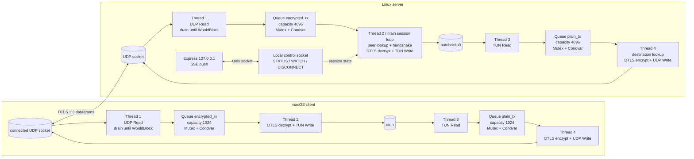
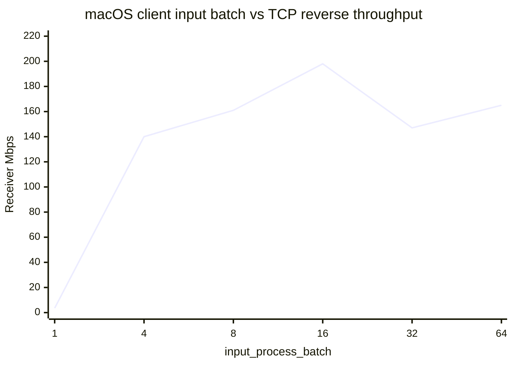

# autobricks-vpn

wolfSSL 기반 DTLS 1.3 VPN transport shared library와 서버/클라이언트 예제입니다.

```text
Autobricks VPN 1.0
Copyright © 2026 Autobricks.co.kr. All rights reserved.
```

## 지원 기능

| 구분 | 지원 내용 |
| --- | --- |
| 서버 운영체제 | Linux, macOS |
| 클라이언트 운영체제 | Linux, macOS, Windows (Wintun) |
| 전송 계층 | UDP 기반 wolfSSL DTLS 1.3, DTLS 재전송 및 DTLS 1.2 빌드 fallback |
| 터널 트래픽 | IPv4 unicast, TCP, UDP, ICMP |
| TUN 설정 | OS별 TUN 생성, IPv4 주소·MTU·VPN 대역 route 자동 설정 |
| 상호 인증 | CA 기반 서버/클라이언트 인증서 검증 |
| 클라이언트 할당 | 인증서 SHA-256 fingerprint별 고정 VPN IP |
| SAN 검증 | 서버 SAN IP 검증, 선택적인 클라이언트 SAN IP 검증 |
| 인증서 폐기 | CRL 및 OCSP(AIA URL 또는 override URL), 실패 시 연결 거부 |
| 세션 관리 | keepalive, idle timeout, 최대 세션 수명, 고정 3초 재연결, 재인증 |
| 설정 갱신 | 서버 인증서·키·CA와 client fingerprint binding 주기적 reload |
| 공격 방어 | stateless DTLS cookie, pending handshake 제한, 출발지 IP spoofing 방지, panic 격리 |
| 접속 제한 | 외부 IP별 1분 30회 handshake 시도 시 10분간 메모리 ban |
| 전달 정책 | 설정에 따른 IPv4 broadcast/multicast 허용 또는 폐기 |
| DNS | VPN DNS 강제 적용 및 정상 종료 시 복구 |
| 운영 로그 | 연결과 해지·세션 사용량을 syslog `local0.info`에 기록, rsyslog로 `/var/log/autobricks-vpn.log` 저장 가능 |
| Linux 전달 | 실행 파일이 IPv4 forwarding과 VPN client 간 iptables 규칙을 직접 관리 |

## 지원하지 않는 기능

- IPv6: 현재 제품 범위에 필요하지 않아 지원하지 않습니다.
- 외부 인터넷 또는 외부 LAN 접속: VPN 내부 통신 전용입니다.
- NAT/MASQUERADE 및 인터넷 default route 변경
- split DNS 또는 fallback DNS: `force_dns = true`이면 모든 DNS 질의가 지정한 VPN DNS를 사용합니다.
- Windows 서버
- 모바일 roaming 또는 연결 중 UDP endpoint의 NAT rebinding: 연결이 끊기면 새 DTLS 세션으로 재접속합니다.
- 무중단 기존 DTLS 세션의 인증서·키 교체: 최대 세션 수명 후 재접속하면서 새 인증 정보를 적용합니다.
- 자동 CRL 다운로드: `crl_file`로 지정한 로컬 CRL을 사용합니다.
- 영구 ban 저장: 접속 제한 정보는 프로세스 메모리에만 유지합니다.
- packet payload 로그 및 packet별 트래픽 로그
- Prometheus 같은 별도 metrics endpoint
- 경로 MTU 자동 탐색: 설정된 고정 TUN MTU를 사용합니다.

지원하지 않는 항목 중 IPv6, NAT 및 외부 인터넷 연결은 현재 설계 목적상 구현 대상이 아닙니다.

## 서버·클라이언트 패킷 처리 구성

### 현재 구현: 4-thread I/O pipeline

서버와 클라이언트의 packet path는 UDP Read, TUN Read, TUN Write, UDP Write의 네 역할로 분리합니다. 두 Read thread는 입력을 읽어 bounded queue에 넣고 작업 thread를 깨우는 일만 수행합니다. 따라서 DTLS 암복호화 또는 출력 장치가 느려져도 UDP와 TUN 입력을 계속 읽을 수 있습니다.



`Queue<T>`는 내부 `Mutex`와 `Condvar`를 가지며 생성할 때 최대 packet 수를 결정합니다. 생산자는 queue가 가득 찰 때 기다리지 않고 가장 오래된 packet을 제거한 뒤 새 packet을 넣고 소비자를 즉시 깨웁니다. 소비자는 queue가 비어 있을 때만 `Condvar`에서 대기합니다. 종료 시에는 stop bit를 먼저 설정하고 queue를 닫아 대기 중인 작업 thread를 깨우며, 남은 packet은 처리하지 않습니다.

각 wolfSSL session은 `SynchronizedDtls`가 소유합니다. queue 대기와 UDP/TUN read에는 session mutex를 사용하지 않고, 동일 `WOLFSSL*`에 대한 handshake/read/write/timeout 호출 구간만 직렬화합니다. 서버의 control socket은 로컬 Express 관리 프로세스에만 연결되며 `WATCH` 상태 변경을 SSE로 전달하므로 HTTP 주기 polling은 없습니다.

### 현재 패킷 흐름

클라이언트에서 서버로 보내는 흐름은 다음과 같습니다.

```text
Application
  -> macOS IP stack
  -> utun
  -> client TUN Read
  -> plain TX queue
  -> client wolfSSL DTLS encrypt
  -> client UDP Write
  -> Internet UDP
  -> server UDP Read
  -> encrypted RX queue
  -> endpoint session lookup
  -> server wolfSSL DTLS decrypt
  -> source VPN IP validation
  -> server TUN write
  -> server IP stack / destination service
```

서버에서 클라이언트로 보내는 흐름은 다음과 같습니다.

```text
Server service / remote VPN client
  -> server IP stack
  -> autobricks0 TUN
  -> server TUN Read
  -> plain TX queue
  -> destination VPN IP session lookup
  -> session wolfSSL DTLS encrypt
  -> server UDP Write
  -> Internet UDP
  -> client UDP Read
  -> encrypted RX queue
  -> client DTLS decrypt / TUN Write
  -> IPv4 packet validation
  -> utun write
  -> macOS IP stack
  -> Application
```

Queue가 가득 차면 가장 오래된 packet을 제거해 메모리 사용량과 지연을 제한합니다. 방향별 overflow 수는 연결 또는 서버 종료 시 로그로 출력합니다. TCP 신뢰성과 재전송은 tunnel 내부의 TCP endpoint가 담당하며 DTLS application data 자체는 손실 packet을 재전송하지 않습니다.

## 개발환경 구성

### 공통 요구사항

- Rust stable toolchain과 Cargo (Rust 2021 edition)
- C compiler와 linker
- wolfSSL header와 library
- 인증서 확인 및 테스트 인증서 생성을 위한 OpenSSL CLI
- 소스에서 wolfSSL을 빌드할 경우 Git, Autoconf, Automake, Libtool, Make, pkg-config

Rust는 rustup으로 설치하는 것을 권장합니다.

```sh
curl --proto '=https' --tlsv1.2 -sSf https://sh.rustup.rs | sh
rustup default stable
rustc --version
cargo --version
```

전체 기능을 사용하는 개발용 wolfSSL은 DTLS 1.3, CRL 및 OCSP를 포함해 빌드합니다.
사용 가능한 옵션과 버전별 차이는 [wolfSSL 공식 빌드 문서](https://www.wolfssl.com/documentation/manuals/wolfssl/chapter02.html)를 기준으로 확인합니다.

```sh
git clone https://github.com/wolfSSL/wolfssl.git
cd wolfssl
./autogen.sh
./configure --prefix=/opt/wolfssl-autobricks \
  --enable-dtls --enable-dtls13 --enable-dtls-mtu \
  --enable-crl --enable-ocsp --enable-opensslextra \
  --enable-ip-alt-name \
  --enable-aesni --enable-intelasm --enable-sp --enable-sp-asm
make -j4
sudo make install
```

`--enable-aesni`, `--enable-intelasm`, `--enable-sp --enable-sp-asm`는 x86_64에서 AES-NI 및 SIMD 기반 암호 연산을 켭니다. 이 플래그 없이 빌드하면 wolfSSL은 순수 소프트웨어 AES로 동작해 패킷당 암복호화 비용이 눈에 띄게 커집니다. ARM64(예: Apple Silicon, AWS Graviton)에서는 대신 `--enable-armasm`을 사용합니다. 빌드 후 `grep -E "AESNI|USE_INTEL_SPEEDUP" /opt/wolfssl-autobricks/include/wolfssl/options.h`로 실제로 활성화됐는지 확인할 수 있습니다.

프로젝트 빌드 시 설치 위치와 Rust의 DTLS 1.3 코드를 함께 지정합니다.

```sh
WOLFSSL_PREFIX=/opt/wolfssl-autobricks cargo build --features dtls13
```

`WOLFSSL_PREFIX` 아래에는 `include/wolfssl/`과 `lib/libwolfssl` shared/static library가 있어야 합니다. Rust의 `dtls13` feature만 켜거나 wolfSSL만 DTLS 1.3으로 빌드해서는 안 되며 두 설정이 일치해야 합니다. CRL/OCSP를 설정에서 활성화하려면 wolfSSL도 해당 기능을 포함해야 합니다. 인증서 fingerprint와 SAN 처리에 사용하는 X509 호환 API를 위해 `--enable-opensslextra`가 필요하고, IP Address SAN을 문자열로 열거하려면 `--enable-ip-alt-name`도 필요합니다. 서버 SAN IP는 DTLS 인증서 체인 검증이 완료된 뒤 인증서의 IP Address SAN을 직접 대조하므로 Homebrew wolfSSL에 없는 `wolfSSL_check_ip_address` 심볼에 의존하지 않습니다.

### Linux 개발환경

Ubuntu/Debian 기준 기본 도구는 다음과 같이 설치합니다.

```sh
sudo apt update
sudo apt install build-essential pkg-config git autoconf automake libtool openssl \
  iproute2 iptables systemd-resolved
```

배포판의 `libwolfssl-dev`도 사용할 수 있지만 DTLS 1.3, CRL 및 OCSP 포함 여부가 배포판마다 다릅니다. 위의 소스 빌드는 프로젝트의 전체 기능을 확인하기 위한 권장 구성입니다.

Linux 실행 환경에서는 `/dev/net/tun`과 `ip`, `iptables`, `sysctl`을 사용합니다. DNS 강제 적용을 테스트하려면 `resolvectl`을 제공하는 `systemd-resolved`가 실행 중이어야 합니다.

### macOS 개발환경

Xcode Command Line Tools와 Homebrew 개발 도구를 설치합니다.

```sh
xcode-select --install
brew install rust pkg-config autoconf automake libtool openssl@3
```

Homebrew의 wolfSSL 패키지로 기본 빌드를 시험할 수 있습니다.

```sh
brew install wolfssl
cargo build
```

DTLS 1.3과 CRL/OCSP를 모두 같은 설정으로 검증하려면 공통 절의 wolfSSL 소스 빌드를 사용하고 `WOLFSSL_PREFIX`를 지정합니다. macOS 실행 환경은 내장된 `ifconfig`, `route`, `networksetup`을 사용합니다.

### Windows 클라이언트 개발환경

Windows는 클라이언트만 빌드할 수 있습니다. 다음 항목이 필요합니다.

- Rust stable `x86_64-pc-windows-msvc` toolchain
- Visual Studio Build Tools의 Desktop development with C++ workload
- MSVC로 빌드한 wolfSSL (`include`와 `lib` 디렉터리)
- Wintun 배포 파일의 아키텍처에 맞는 `wintun.dll`

PowerShell에서 경로를 설정하고 빌드합니다.

```powershell
rustup default stable-x86_64-pc-windows-msvc
$env:WOLFSSL_PREFIX = "C:\wolfssl"
$env:WINTUN_DLL = "C:\path\to\wintun.dll"
cargo build --bin vpn-client --features dtls13
Copy-Item $env:WINTUN_DLL target\debug\wintun.dll
```

`C:\wolfssl` 아래에는 `include\wolfssl`과 링커가 찾을 수 있는 `lib\wolfssl.lib`가 있어야 합니다. wolfSSL과 Rust target은 같은 MSVC ABI와 CPU architecture로 빌드해야 합니다. 실행 시 Wintun adapter, IPv4 주소, route 및 NRPT DNS 규칙을 구성합니다.

### 개발 빌드 검증

```sh
cargo fmt --check
cargo check --all-targets --all-features
cargo test --lib
cargo clippy --all-targets --all-features
```

`cargo check`는 Rust 코드 검증만 수행할 수 있지만 실행 파일을 생성하는 `cargo build`와 실제 구동에는 wolfSSL library가 필요합니다. 테스트용 인증서 경로는 `certs/`이며 개인키는 Linux/macOS에서 소유자만 읽을 수 있도록 설정합니다.

```sh
chmod 600 certs/*-key.pem
```

### 클라이언트 실환경 검증 현황

| 클라이언트 환경 | 서버 환경 | 검증 항목 | 결과 |
| --- | --- | --- | --- |
| Ubuntu 22.04.5 LTS, x86_64, wolfSSL 5.9.1 | Ubuntu 22.04.4 LTS, x86_64 | DTLS 1.3 상호 인증, 인증서 fingerprint/SAN 기반 VPN IP 할당, TUN/MTU 1350, NAT·UDP 포트포워딩 경유 연결, ICMP, TCP/HTTP, VPN DNS, 클라이언트 간 통신 | 성공 |
| macOS 14.6.1, arm64, Rust 1.97.1, wolfSSL 5.9.1 | Ubuntu 22.04.4 LTS, x86_64 | DTLS 1.3 상호 인증, 인증서 fingerprint/SAN 기반 VPN IP 할당, utun/MTU 1350, NAT·UDP 포트포워딩 경유 연결, ICMP, TCP/HTTP, VPN DNS, Linux 클라이언트 접속 | 성공 |
| Windows | Ubuntu Linux | Wintun 생성, DTLS 연결, 인증서 검증, VPN route 및 실제 터널 통신 | 미검증 (테스트 예정) |

위 표의 성공은 빌드 또는 단위 테스트만의 결과가 아니라 실제 서버와 클라이언트를 실행해 터널 트래픽을 확인한 결과입니다. Windows 코드는 빌드 경로를 제공하지만 아직 실제 Windows 장비에서 검증하지 않았습니다.

현재 개발용 debug 빌드의 실환경 비교에서는 WireGuard보다 처리 속도가 최대 약 3배 낮게 관찰되었습니다. 이는 확정된 제품 성능 수치가 아니며, 사용자 공간의 TUN/DTLS 처리, packet 복사, 단일 event loop와 최적화되지 않은 debug 빌드가 함께 영향을 줄 수 있습니다. 백업 VPN 기능 검증 단계에서는 현재 구현을 유지하고, 릴리스 준비 시 release 빌드 전환, `iperf3` 정방향·역방향 측정, CPU 사용률과 packet loss 확인, MTU 및 packet 처리 경로 최적화를 진행한 뒤 다시 비교할 예정입니다.

## Build

VPN 구현이 들어 있는 동적 라이브러리와 이를 호출하는 `vpn-server`, `vpn-client` launcher를 Cargo로 빌드합니다.

OS 종속 packet I/O와 TUN 구현은 공통 DTLS/session 코드와 분리되어 있습니다.

| 경로 | 현재 구현 | 확장 경계 |
| --- | --- | --- |
| `src/linux/` | `/dev/net/tun`, nonblocking UDP, `poll` readiness | `io_uring` completion 및 batch I/O |
| `src/macos/` | `utun`, 4-byte protocol header, `poll` readiness | `kqueue` readiness |
| `src/windows/` | Wintun ring, nonblocking UDP 확인 | Overlapped I/O/IOCP와 Wintun read event |

공통 client/server 루프는 OS API를 직접 호출하지 않고 선택된 platform backend의 `wait_udp`, `wait_io` 및 `Tun`을 사용합니다. 따라서 이후 Linux `io_uring` 또는 Windows IOCP를 도입할 때 DTLS 인증과 session routing 코드를 별도로 복제하지 않습니다.

```sh
brew install wolfssl
cargo build
```

wolfSSL이 `WOLFSSL_DTLS13`으로 빌드된 경우 DTLS 1.3 method를 사용합니다. 해당 옵션이 없는 배포 패키지에서는 빌드 검증을 위해 DTLS 1.2 method로 fallback하므로, production DTLS 1.3 배포에는 DTLS 1.3이 활성화된 wolfSSL을 직접 빌드해 링크해야 합니다.

CRL과 OCSP를 사용하려면 wolfSSL을 `--enable-crl --enable-ocsp` 옵션으로 빌드해야 합니다. 설정에서 해당 검증을 요청했는데 라이브러리가 지원하지 않으면 VPN은 폐기 검사를 생략하지 않고 시작을 중단합니다.

Linux에서는 wolfSSL 개발 패키지를 설치한 뒤 `WOLFSSL_PREFIX=/path/to/wolfssl cargo build`를 실행합니다. macOS에서는 `target/debug/libautobricks_vpn.dylib`, Linux에서는 `target/debug/libautobricks_vpn.so`가 생성됩니다.

빌드 결과는 다음 구조로 배치됩니다. launcher는 기본적으로 자신의 실행 파일과 같은 디렉터리에서 autobricks-vpn 동적 라이브러리를 찾습니다.

```text
Linux
target/debug/vpn-server
target/debug/vpn-client
target/debug/libautobricks_vpn.so

macOS
target/debug/vpn-server
target/debug/vpn-client
target/debug/libautobricks_vpn.dylib

Windows
target/debug/vpn-client.exe
target/debug/autobricks_vpn.dll
target/debug/wintun.dll
```

라이브러리를 다른 위치에 배치한 경우 `AUTOBRICKS_VPN_LIBRARY`에 전체 경로를 지정할 수 있습니다. wolfSSL 자체도 운영체제의 dynamic loader가 찾을 수 있는 경로에 설치되어 있어야 합니다.

```sh
AUTOBRICKS_VPN_LIBRARY=/opt/autobricks/lib/libautobricks_vpn.so \
  /opt/autobricks/bin/vpn-server --config /etc/autobricks-vpn/server.ini
```

서버는 Linux와 macOS만 지원합니다. Windows는 클라이언트만 지원하며 Wintun driver와 `wintun.dll`이 필요합니다. wolfSSL Windows 빌드 경로를 지정하고 Wintun DLL을 실행 파일 옆에 둔 뒤 실행합니다.

```powershell
$env:WOLFSSL_PREFIX = "C:\wolfssl"
$env:WINTUN_DLL = "C:\path\to\wintun.dll"
cargo build --bin vpn-client
```

Windows TUN adapter는 `wintun` crate로 생성하며 관리자 권한이 필요합니다. `netsh`와 `route`로 IPv4 주소 및 VPN route를 자동 설정합니다.

## API

실제 서버와 클라이언트 구현은 각각 `src/server.rs`, `src/client.rs`에 있으며 `src/lib.rs`가 다음 C ABI 함수를 export합니다. 공개 선언은 `include/autobricks_vpn.h`에 있습니다.

```c
int autobricks_vpn_server_run(const char *config_path);
int autobricks_vpn_client_run(const char *config_path);
```

설정 파일 경로는 필수이며 launcher의 `-c` 또는 `--config` 옵션으로 전달합니다. `--config=/path/to/config.ini` 형식도 지원하며 `-h` 또는 `--help`로 사용법을 확인할 수 있습니다. C API에서도 `config_path`가 `NULL`, 빈 문자열 또는 올바른 UTF-8 경로가 아니면 상태 `2`로 거부합니다. 정상 종료는 `0`, 설정 또는 실행 오류는 `1`, 격리된 panic은 `3`, 지원하지 않는 운영체제의 서버 호출은 `4`를 반환합니다.

`vpn-server`와 `vpn-client` 실행 파일에는 VPN 구현이 들어 있지 않습니다. Linux/macOS에서는 `dlopen`/`dlsym`, Windows에서는 `LoadLibraryW`/`GetProcAddress`로 동적 라이브러리를 열고 위 API를 호출하는 launcher입니다. 따라서 실행하려면 해당 운영체제용 autobricks-vpn 동적 라이브러리가 반드시 필요합니다. wolfSSL은 동적 라이브러리 내부에서 Rust FFI로 호출합니다.

서버는 unconnected UDP socket을 유지하며 최대 64개의 client별 DTLS session을 관리합니다. 각 session은 client의 UDP peer, 인증서 fingerprint, 고정 VPN IP를 가지고, TUN packet의 목적지 IP에 따라 해당 client로 전달합니다. 서버와 클라이언트 실행 파일이 운영체제별 TUN 생성, IPv4 주소, MTU 및 VPN 대역 route 설정을 수행합니다.

인증된 동시 세션 수는 `server.ini`의 `max_clients`로 설정합니다. 기본값은 64이고 현재 허용 범위는 1~1024입니다. 인증 전 handshake는 `max_pending_handshakes`(기본값 16, 허용 범위 1~256)로 별도 제한하며, 같은 출발지 IP에는 최대 2개만 허용하고 10초 안에 완료되지 않은 handshake는 제거합니다. 한도가 찬 경우 가장 오래된 미인증 handshake를 교체하므로 미인증 패킷이 인증된 세션 자리를 점유하지 않습니다.

서버의 일반 unicast 경로는 UDP peer endpoint와 VPN IP를 각각 `HashMap`으로 인덱싱해 세션을 O(1)로 찾습니다. 인증서 fingerprint도 역방향 `HashMap`으로 VPN IP를 조회합니다. 전체 세션 순회는 broadcast/multicast 전달, timeout 정리와 관리 상태 snapshot에만 사용합니다.

DTLS 쓰기가 `WouldBlock`이면 아직 전송되지 않은 내부 패킷을 세션별 송신 대기 queue에 보관합니다. queue는 세션당 최대 256패킷이며 가득 차면 가장 오래된 패킷을 제거합니다. 2초 이상 대기한 패킷은 폐기하고 한 event-loop 회차에 세션당 최대 32패킷만 처리해 한 클라이언트가 다른 세션의 송신을 독점하지 않게 합니다. 성공한 DTLS application record는 이 queue에서 재전송하지 않습니다.

활성 세션은 트래픽 유무와 관계없이 `max_session_lifetime` 이후 제거되며 기본값은 3600초, 허용 범위는 60~604800초입니다. 클라이언트가 다시 연결할 때 전체 certificate 인증과 새 key 협상을 수행하므로 장기 세션의 인증 상태가 무기한 유지되지 않습니다.

서버는 `config_reload_interval`마다 설정 파일의 `[client]` fingerprint 매핑을 다시 읽습니다. 기본값은 30초이고 허용 범위는 5~3600초입니다. 삭제되거나 변경된 binding의 활성 세션은 즉시 제거하며, 새 DTLS acceptor도 다시 만들어 갱신된 서버 인증서·개인키·CA 파일을 이후 handshake에 반영합니다. reload 검증이 실패하면 기존 정상 설정과 세션을 유지합니다.

## Push 전 검사

필요할 때 아래 명령으로 push 전 검사를 실행합니다. 프로젝트용 wolfSSL 경로를 명시해야 하며 기본 feature는 `dtls13`입니다. panic gate 단위 테스트는 한 개씩 실행하면서 각 테스트의 시작과 검증 결과를 로그로 출력하고, 이어서 전체 테스트, Clippy와 diff 검사를 수행합니다.

```sh
WOLFSSL_PREFIX=/path/to/project-wolfssl ./scripts/pre-push-test.sh
```

다른 feature 조합이 필요하면 `AUTOBRICKS_VPN_FEATURES`로 지정합니다.

```sh
WOLFSSL_PREFIX=/path/to/project-wolfssl \
  AUTOBRICKS_VPN_FEATURES=dtls13 \
  ./scripts/pre-push-test.sh
```

## Example

```sh
sudo ./target/debug/vpn-server --config server.ini
sudo ./target/debug/vpn-client --config client.ini
```

## 성능 측정 기록

성능 변경은 아래에 날짜별로 누적합니다. 이후 최적화에서도 기존 결과를 덮어쓰지 않고 새 날짜의 항목을 추가합니다. 비교 시에는 측정 장비, 경로, build profile, packet 크기, 방향과 반복 횟수를 함께 기록합니다.

모든 신규 성능 측정에는 다음 조건을 반드시 함께 남깁니다. 하나라도 확인하지 못한 항목은 추정하지 않고 `미기록`으로 표시하며, 조건이 다른 결과끼리는 직접적인 성능 향상·회귀로 단정하지 않습니다.

- 측정 날짜·시간대와 client/server 장비 및 운영체제
- client/server commit 또는 source 상태와 실행 binary/library SHA-256
- client/server build profile, feature와 wolfSSL version
- VPN endpoint, 방향, MTU, packet/payload 크기와 수신 처리 구조
- TUN/UDP drain·process batch, queue 용량과 TTL
- 측정 명령, protocol, stream 수, 측정 시간, warm-up 제외 시간과 반복 횟수
- 각 반복의 개별값, 평균 또는 중앙값, TCP retransmission이나 UDP loss/jitter
- 동일 시점 WireGuard 또는 직접 경로 비교값
- 측정 전후 서비스 상태와 임시 process/firewall 정리 여부

재현 가능한 기록은 다음 형식을 사용합니다.

```text
Date/time:
Client: OS / CPU / commit / build profile / binary SHA-256 / wolfSSL
Server: OS / CPU / commit / build profile / library SHA-256 / wolfSSL
Path: endpoint / direction / MTU / receive architecture
Tuning: TUN drain/process / UDP drain/process / queue capacity/TTL
Command: exact iperf3 or copy command
Runs: individual results including retransmission/loss/jitter
Reference: same-window WireGuard/direct result
Cleanup: client/iperf/firewall/service status
```

### 2026-09-18 - 초기 상태 회고

초기 개발 빌드는 같은 Ubuntu 서버의 WireGuard 경로와 비교했을 때 파일 전송이 약 3배 느렸습니다. 이는 2026-09-18에 기록한 개발 과정의 회고값이며 당시의 정밀한 원시 측정 로그는 남아 있지 않습니다. 이후 release 빌드, TUN non-blocking 처리, OS별 I/O 분리, 세션 HashMap 인덱스, 제한된 송신 대기 queue와 Linux ICMP Redirect 차단을 적용했습니다.

### 2026-09-18 - 공통 측정 환경

- 클라이언트: Apple Silicon MacBook Air, macOS 14
- 서버: `10.10.254.1`, Ubuntu 22.04, Linux `6.8.0-136-generic`, x86_64, 12 CPU
- Autobricks VPN: client `10.8.1.2`, server `10.8.1.1`, configured UDP endpoint, DTLS 1.3, MTU 1350
- WireGuard: 동일 클라이언트에서 동일 서버의 `10.10.254.1` 사용
- Autobricks 서버: release build, wolfSSL 5.9.1 계열 `libwolfssl.so.44`
- `iperf3`: macOS 3.21.1, Ubuntu 3.9

### 2026-09-18 - Ping RTT

| 단계 | 대상 | 표본 | 평균 RTT | 최소 | 최대 | 손실 |
|---|---|---:|---:|---:|---:|---:|
| HashMap/queue 변경 전 | Autobricks `10.8.1.1` | 29 | 16.33 ms | 8.588 ms | 25.216 ms | 0% |
| 변경 직후 첫 측정 | Autobricks `10.8.1.1` | 13 | 18.44 ms | 11.477 ms | 27.280 ms | 0% |
| 변경 후 안정화 측정 | Autobricks `10.8.1.1` | 24 | 13.01 ms | 7.547 ms | 20.588 ms | 0% |
| 비교 측정 | WireGuard `10.10.254.1` | 30 | 14.25 ms | 8.739 ms | 18.954 ms | 0% |

안정화 측정의 Autobricks 평균 RTT는 WireGuard와 유사했습니다. 작은 ICMP 패킷의 RTT는 인터넷·Wi-Fi jitter 영향을 크게 받으므로 터널 처리량 판단에는 SCP와 `iperf3` 결과를 함께 사용합니다.

### 2026-09-18 - SCP 128 MiB 1차 측정

SSH 압축을 비활성화하고 각 경로를 3회 교차 측정했습니다. 업로드와 다운로드 후 모든 파일의 크기와 SHA-256이 원본과 일치했습니다.

| 방향 | Autobricks 개별 시간 | Autobricks 평균 | WireGuard 개별 시간 | WireGuard 평균 |
|---|---|---:|---|---:|
| macOS → 서버 | 4.95 / 5.07 / 5.16초 | 5.06초, 약 202 Mbps | 4.51 / 4.11 / 3.70초 | 4.11초, 약 249 Mbps |
| 서버 → macOS | 4.51 / 4.56 / 4.62초 | 4.56초, 약 224 Mbps | 4.71 / 4.35 / 4.33초 | 4.46초, 약 229 Mbps |

1차 측정에서 다운로드는 약 2% 차이였고 업로드는 WireGuard가 약 23% 높았습니다.

### 2026-09-18 - SCP 실행 순서 반전

1차 테스트의 순서 편향을 확인하기 위해 `WireGuard → Autobricks` 순서로 3회 반복했습니다. 파일 크기와 SHA-256은 모두 일치했습니다.

| 경로 | 개별 업로드 시간 | 평균 시간 | 환산 처리량 |
|---|---|---:|---:|
| WireGuard | 3.85 / 3.89 / 3.94초 | 3.89초 | 약 263 Mbps |
| Autobricks | 6.04 / 6.41 / 5.08초 | 5.84초 | 약 175 Mbps |

두 SCP 업로드 테스트를 합친 6회 평균은 WireGuard 4.00초, 약 256 Mbps이고 Autobricks 5.45초, 약 188 Mbps입니다. 순서를 반대로 해도 WireGuard 업로드가 빨랐으므로 첫 결과는 단순한 warm-up 순서 효과가 아니었습니다.

### 2026-09-18 - iperf3 TCP 단일 스트림

각 방향을 15초 측정하고 초기 2초를 제외했습니다.

| 방향 | Autobricks | WireGuard | Autobricks TCP 재전송 | WireGuard TCP 재전송 |
|---|---:|---:|---:|---:|
| macOS → 서버 | 244.7 Mbps | 294.7 Mbps | 126 | 5 |
| 서버 → macOS | 271.3 Mbps | 248.6 Mbps | 567 | 1,730 |

단일 스트림 업로드는 Autobricks가 약 17% 낮았고 다운로드는 약 9% 높았습니다.

### 2026-09-18 - iperf3 TCP 4병렬 스트림

각 방향을 10초 측정하고 초기 2초를 제외했습니다.

| 방향 | Autobricks | WireGuard |
|---|---:|---:|
| macOS → 서버 | 247.1 Mbps | 289.3 Mbps |
| 서버 → macOS | 307.3 Mbps | 303.0 Mbps |

Autobricks 업로드에서 한 차례 121.4 Mbps가 측정됐지만 즉시 재측정하면 247.1 Mbps로 회복되어 일시적인 외부 경로 변동으로 분류했습니다. 247 Mbps 업로드 중 `vpn-server` CPU는 단일 코어 기준 약 40~75%였습니다.

### 2026-09-18 - iperf3 UDP 250 Mbps

내부 MTU에서 IP fragmentation을 피하기 위해 UDP payload를 1,200바이트로 지정하고 각 방향을 10초 측정했습니다.

| 방향 | 경로 | 처리량 | 손실 | Jitter |
|---|---|---:|---:|---:|
| macOS → 서버 | Autobricks | 250.0 Mbps | 0.109% | 0.028 ms |
| macOS → 서버 | WireGuard | 250.0 Mbps | 0.364% | 0.041 ms |
| 서버 → macOS | Autobricks | 250.0 Mbps | 0% | 0.067 ms |
| 서버 → macOS | WireGuard | 250.0 Mbps | 0% | 0.163 ms |

250 Mbps에서는 두 VPN 모두 목표 처리량을 전달했고 Autobricks의 손실률과 jitter가 낮았습니다.

### 2026-09-18 - iperf3 UDP 350 Mbps 한계 측정

macOS에서 서버 방향으로 1,200바이트 UDP payload를 10초 전송했습니다.

| 경로 | 송신률 | 손실 | Jitter |
|---|---:|---:|---:|
| Autobricks | 350.8 Mbps | 5.80% | 0.010 ms |
| WireGuard | 350.0 Mbps | 12.95% | 0.018 ms |

350 Mbps에서는 두 경로 모두 손실이 발생해 물리 네트워크 한계에 진입했습니다. Autobricks `vpn-server` CPU는 활성 구간에서 단일 코어 기준 약 56~74%였으므로 서버 CPU 100% 포화가 직접 한계는 아니었습니다.

### 2026-09-18 - 결과와 다음 비교 항목

- Ping RTT와 TCP 다운로드는 WireGuard와 동급입니다.
- TCP 업로드는 Autobricks가 대략 15~17% 낮았습니다.
- UDP 250 Mbps에서는 Autobricks가 WireGuard보다 낮은 손실률과 jitter를 보였습니다.
- 350 Mbps UDP에서는 두 경로 모두 물리 경로 한계로 손실이 증가했습니다.
- 다음 최적화 비교에서는 map 전체 재구성 제거, client `WouldBlock` queue, 조건부 `POLLOUT`, queue/drop 계측과 macOS TUN copy 축소의 효과를 각각 분리해 측정합니다.
- 테스트용 `iperf3` daemon과 임시 firewall rule은 측정 직후 제거했습니다.

### 2026-09-18 - client 송신 queue 적용 후 재측정

macOS release client에 UDP `WouldBlock` 시 packet을 버리지 않는 bounded queue를 적용한 뒤 같은 `10.8.1.2 -> 10.8.1.1` 경로에서 다시 측정했습니다. queue는 최대 256 packet, TTL 2초, loop당 최대 32 packet을 전송하며, queue가 비어 있지 않을 때만 UDP `POLLOUT`을 감시합니다.

| 항목 | 방향 | 결과 |
|---|---|---:|
| TCP 4병렬, 8초, 3회 평균 | macOS → 서버 | 245.0 Mbps |
| TCP 4병렬, 8초, 3회 평균 | 서버 → macOS | 293.7 Mbps |
| TCP 단일, 8초, 3회 평균 | macOS → 서버 | 277.7 Mbps |
| TCP 단일, 8초, 1회 | 서버 → macOS | 266 Mbps |
| UDP 250 Mbps, 10초 | macOS → 서버 | 0.19% loss, 0.032 ms jitter |
| UDP 250 Mbps, 10초 | 서버 → macOS | 0% loss, 0.093 ms jitter |
| UDP 350 Mbps, 10초, 1차 | macOS → 서버 | 15% loss, 0.014 ms jitter |
| UDP 350 Mbps, 10초, 2차 | macOS → 서버 | 0.27% loss, 0.059 ms jitter |
| UDP 350 Mbps, 10초, 1차 | 서버 → macOS | 19% loss, 0.032 ms jitter |
| UDP 350 Mbps, 10초, 2차 | 서버 → macOS | 19% loss, 0.039 ms jitter |

TCP 4병렬 결과는 queue 적용 전의 정방향 247.1 Mbps, 역방향 307.3 Mbps와 같은 범위이므로 이번 변경만으로 TCP 처리량 향상이 확인되지는 않았습니다. UDP 250 Mbps는 계속 안정적이지만 350 Mbps 정방향은 측정 간 편차가 크고, 역방향은 약 19% 손실이 반복됐습니다. client 송신 queue는 주로 macOS → 서버 방향의 순간적인 UDP socket backpressure를 보호하므로 서버 → macOS 손실은 해결하지 못합니다. 다음 분석에서는 client의 DTLS read와 TUN write 처리량, 수신 socket buffer, 한 번의 readiness당 처리하는 datagram 수와 queue 통계를 함께 계측해야 합니다.

TCP 부하와 동시에 실시한 ping 20회는 손실 0%, 평균 26.707 ms, 최대 122.009 ms였습니다. 유휴 상태의 이전 평균 13.01 ms보다 지연과 편차가 증가했으므로 처리량뿐 아니라 부하 중 latency도 계속 비교합니다. 테스트 종료 후 `iperf3` daemon과 임시 TCP/UDP 5201 firewall rule을 제거했으며 VPN 서비스는 `active`, 재시작 횟수는 0이었습니다.

### 2026-09-18 - server/client batch drain 비교

클라이언트의 TUN 및 DTLS 입력과 서버의 TUN 입력은 wakeup당 최대 64 packet을 처리하고 있었습니다. 남아 있던 서버 UDP 단일 수신을 bounded batch로 변경한 뒤 batch 크기와 서버 `POLLOUT` 감시를 분리해 A/B 측정했습니다.

- 서버 UDP batch 64와 조건부 `POLLOUT`: TCP 4병렬 정방향 평균 308 Mbps, 역방향 안정 구간 약 217 Mbps였습니다. 첫 역방향 측정은 19.5 Mbps까지 하락했습니다.
- 서버 `POLLOUT` 제거, UDP batch 64: 역방향 206/226/230 Mbps였고 정방향은 94/126/193 Mbps로 측정 간 편차가 컸습니다. 따라서 `POLLOUT` 하나만이 회귀 원인은 아니었습니다.
- 서버 UDP batch 16, TUN batch 64, 서버 `POLLOUT` 비활성화를 최종값으로 선택했습니다. UDP ACK burst가 TUN 송신을 오래 점유하지 않도록 UDP 쪽의 batch를 더 작게 제한했습니다.

최종 상태에서 같은 wildcard `iperf3` server를 사용하고 매 측정마다 Autobricks와 WireGuard 순서로 교차 실행했습니다.

| 프로토콜/부하            | 방향         |         Autobricks |          WireGuard |                    비교 |
| ------------------ | ---------- | -----------------: | -----------------: | --------------------: |
| TCP 4병렬, 8초, 2회 평균 | macOS → 서버 |         344.5 Mbps |         304.0 Mbps |     Autobricks +13.3% |
| TCP 4병렬, 8초, 2회 평균 | 서버 → macOS |         247.5 Mbps |         291.0 Mbps |     Autobricks -14.9% |
| UDP 250 Mbps, 10초  | macOS → 서버 |         0.38% loss |        0.067% loss |       둘 다 249 Mbps 수신 |
| UDP 250 Mbps, 10초  | 서버 → macOS |            0% loss |            0% loss |       둘 다 250 Mbps 수신 |
| UDP 350 Mbps, 10초  | macOS → 서버 |         0.38% loss |        0.069% loss | 둘 다 약 348~349 Mbps 수신 |
| UDP 350 Mbps, 10초  | 서버 → macOS | 19% loss, 283 Mbps | 11% loss, 310 Mbps |          WireGuard 우세 |

최종 유휴 ping 5회는 손실 0%, 평균 13.766 ms였습니다. 서버 UDP batch는 Autobricks의 정방향 TCP 처리량을 WireGuard 이상으로 높였지만, 서버 → macOS의 고부하 수신 경로는 계속 약 15% 낮은 TCP 처리량과 더 높은 UDP 손실을 보였습니다. 다음 최적화 대상은 macOS client의 UDP socket receive buffer, 한 번의 DTLS callback에서 소비되는 datagram 수, 복호화 후 TUN write의 backpressure와 copy 횟수입니다. 테스트 후 `iperf3` daemon과 Autobricks/WireGuard용 임시 TCP·UDP 5201 firewall rule 네 개를 모두 제거했으며 VPN 서비스는 `active`, 재시작 횟수는 0이었습니다.

### 2026-09-18 - 서버 packet-path 고정 메모리 적용 최종 측정

서버 UDP 수신을 1,024개의 사전 할당 datagram slot pool로 변경하고, 세션별 DTLS `WouldBlock` 송신 queue를 256개의 고정 slot ring으로 변경한 상태를 측정했습니다. 서버 release library SHA-256은 `290c236c0203e92aa8b6df4122b7c79c3bf937a9a496fa05ef88773e34b0377a`입니다. 측정 조건은 macOS `iperf3` 3.21.1과 Ubuntu `iperf3` 3.9, MTU 1350, UDP payload 1,200바이트이며 TCP/UDP 모두 초기 2초를 제외하고 8초 또는 10초 측정했습니다.

| 프로토콜/부하 | 방향 | Autobricks | WireGuard | 비교 |
|---|---|---:|---:|---:|
| TCP 단일, 8초 | macOS → 서버 | 284 Mbps | 316 Mbps | Autobricks -10.1% |
| TCP 4병렬, 8초 | macOS → 서버 | 305 Mbps | 260 Mbps | Autobricks +17.3% |
| TCP 단일, 8초 | 서버 → macOS | 156 Mbps, 재측정 180 Mbps | 274 Mbps | 재측정 기준 -34.3% |
| TCP 4병렬, 8초 | 서버 → macOS | 153 Mbps, 재측정 158 Mbps | 286 Mbps | 재측정 기준 -44.8% |
| UDP 250 Mbps, 10초 | macOS → 서버 | 246 Mbps 수신 | 250 Mbps, 0% loss | Autobricks -1.6% |
| UDP 250 Mbps, 10초 | 서버 → macOS | 245 Mbps, 0.11% loss | 250 Mbps, 0% loss | WireGuard 우세 |
| UDP 350 Mbps, 10초 | macOS → 서버 | 292 Mbps 수신 | 312 Mbps 수신 | WireGuard +6.8% |
| UDP 350 Mbps, 10초 | 서버 → macOS | 263 Mbps, 24% loss | 220 Mbps, 37% loss | Autobricks 수신률 우세 |

정방향 TCP는 단일 스트림에서 WireGuard보다 10.1% 낮았지만 4병렬에서는 17.3% 높아 서버의 UDP 수신 slot pool이 정방향 병목을 만들지는 않았습니다. 반면 서버 → macOS TCP는 두 번 측정해도 이전 batch-drain 측정의 247.5 Mbps보다 낮은 153~180 Mbps였습니다. 고정 메모리 적용으로 packet별 Rust heap allocation은 제거했지만, macOS client의 DTLS 수신·복호화·utun write 직렬 경로 또는 측정 시점의 네트워크 상태가 역방향 처리량을 제한했을 가능성이 있습니다. 이번 측정만으로 두 원인을 분리할 수 없으므로 회귀를 해결됐다고 판단하지 않습니다.

정방향 UDP에서는 macOS 3.21.1 client와 Ubuntu 3.9 server 조합이 수신 packet loss 개수를 `Unknown`으로 반환해 손실률을 임의 계산하지 않고 실제 수신 처리량만 기록했습니다. 역방향은 수신 측 macOS가 loss를 계산할 수 있어 해당 값을 기록했습니다. 측정 전 ping 10회는 손실 0%, 평균 15.324 ms였고 측정 후 ping 10회도 손실 0%, 평균 12.863 ms였습니다. 테스트 종료 후 `iperf3`와 임시 UFW 규칙 네 개를 제거했으며 `autobricks-vpn.service`는 `active`, `NRestarts=0` 상태를 유지했습니다.

### 2026-09-18 - macOS client input batch sweep

서버 batch와 코드는 유지하고 macOS client의 `input_process_batch`만 `1, 4, 8, 16, 32, 64`로 변경했습니다. 각 값마다 client를 완전히 종료하고 다시 DTLS handshake한 뒤, 동일한 서버 → macOS TCP 단일 스트림을 `iperf3 -R -t 5 -O 1`로 한 번 측정했습니다. client는 debug profile과 wolfSSL 5.9.1 DTLS 1.3 build를 사용했습니다.

| Client input batch | 수신 처리량 | 서버 TCP 재전송 |
|---:|---:|---:|
| 1 | 3.57 Mbps | 0 |
| 4 | 140 Mbps | 96 |
| 8 | 161 Mbps | 24 |
| 16 | 198 Mbps | 1 |
| 32 | 147 Mbps | 70 |
| 64 | 165 Mbps | 46 |



batch 1은 packet마다 event loop와 readiness 확인으로 돌아가면서 3.57 Mbps까지 하락했습니다. 4에서 16까지는 loop 왕복 비용을 분산하면서 처리량이 증가했고 16에서 198 Mbps와 재전송 1회로 가장 좋은 결과를 보였습니다. 32와 64에서는 한 방향을 오래 연속 처리하면서 반대 방향 TCP ACK 처리가 늦어질 수 있어 처리량과 재전송이 다시 나빠졌습니다. 다만 이 sweep은 당시의 2단계 queued receive 구조에서 얻은 1회 측정값입니다. 이후 client 중간 UDP queue를 제거하고 wolfSSL callback 직접 수신으로 되돌렸으므로 현재 구조의 최적값으로 그대로 해석하지 않습니다. 현재 기본값은 과거 직접 수신 경로와 같은 64이며 `AVPN_INPUT_PROCESS_BATCH` 환경 변수 또는 `client.ini`의 `input_process_batch`로 1~256 범위에서 덮어쓸 수 있습니다. 테스트 후 client, `iperf3`와 임시 UFW 규칙을 종료했고 서버 서비스는 `active`, `NRestarts=0`이었습니다.

같은 batch 16을 macOS release/DTLS 1.3 build로 다시 실행하고 이전 기록과 같은 `-R -t 8 -O 2` 조건으로 두 번 측정한 결과는 144/182 Mbps, 평균 163 Mbps였습니다. 동일 시점 WireGuard 단일 역방향은 279 Mbps였으므로 물리·Wi-Fi 경로 전체가 느려진 결과는 아닙니다. release 최적화만으로 처리량이 회복되지 않았으며, 이 측정 당시 client가 UDP socket을 고정 input queue로 먼저 비운 뒤 `DtlsIo`의 별도 고정 queue로 다시 복사해 wolfSSL이 소비하는 이중 queue 경로가 이전의 callback 직접 수신 경로와 다른 핵심 변수였습니다.

후속 M1 client 전용 A/B에서 중간 client UDP queue를 제거한 단일 `DtlsIo` ring은 batch 16에서 162/161 Mbps였고, ring까지 우회한 wolfSSL callback 직접 socket 수신은 batch 16에서 168/155 Mbps, batch 64에서 164/171 Mbps였습니다. 따라서 client queue와 해당 packet 복사는 회귀의 주원인이 아니었습니다. utun payload 복사를 `readv/writev`로 제거한 직접 수신 batch 64는 169/170 Mbps로 소폭 개선됐지만 이전 247.5 Mbps에는 미치지 못했습니다. 부하 중 M1 client CPU는 약 8~11%, RSS는 약 8.3 MiB로 CPU 포화도 아니었습니다. 이전 247.5 Mbps 측정 당시 서버 TUN 처리 단위 64와 달리 현재 서버 고정 queue 소비 단위는 공용 `INPUT_PROCESS_BATCH=32`이므로, 다음 A/B에서는 서버 송신 측 scheduling 변화가 회귀 원인인지 확인해야 합니다.

이 A/B의 고정 조건은 다음과 같습니다.

| 조건 | 값 |
|---|---|
| 날짜 | 2026-09-18 |
| Client | Apple Silicon M1 MacBook Air, macOS 14, release, DTLS 1.3, wolfSSL 5.9.1 |
| 최종 client library SHA-256 | `96c505a2266f99d0bbb901d12877223b573b4af1bc066bd4b8fdfe964bdec938` |
| 최종 client launcher SHA-256 | `e5f00e17bf3711302f70a08b31045ebc2c02233d4c71f3f71cec725ce27af50b` |
| Server | Ubuntu 22.04, x86_64, release, DTLS 1.3, wolfSSL 5.9.1 |
| Server library SHA-256 | `290c236c0203e92aa8b6df4122b7c79c3bf937a9a496fa05ef88773e34b0377a` |
| VPN path | configured public UDP endpoint, `10.8.1.1 → 10.8.1.2`, MTU 1350 |
| TCP command | `iperf3 -c 10.8.1.1 -R -t 8 -O 2 -f m --connect-timeout 3000` |
| 반복 | 구조/batch 조합별 2회; CPU 표본은 별도 1회 |
| 동일 시점 기준 | WireGuard `10.10.254.1 → 10.10.254.2`, 단일 역방향 279 Mbps |
| Server tuning | UDP drain 16, TUN drain 64, 고정 queue process 32 |
| Client tuning | 직접 callback 최종값 process 64; queued 구조 batch 16도 별도 기록 |
| 정리 상태 | client/iperf3 종료, 임시 UFW rule 제거, VPN server `active`, `NRestarts=0` |

### 2026-09-18 - 4-thread queue pipeline 최종 비교

서버와 macOS 클라이언트에 UDP Read, TUN Read, DTLS decrypt/TUN Write, DTLS encrypt/UDP Write 역할을 분리한 현재 구조를 적용한 뒤 같은 시간대에 서버에서 macOS로 전송하는 역방향 TCP를 비교했습니다. 실제 공인 endpoint는 기록하지 않고 구성된 endpoint로 표기합니다.

| 조건 | Autobricks 개별 결과 | Autobricks 평균 | WireGuard 개별 결과 | WireGuard 평균 |
|---|---:|---:|---:|---:|
| TCP 단일, 8초, 2회 | 349 / 330 Mbps | **339.5 Mbps** | 267 / 82.1 Mbps | **174.6 Mbps** |
| TCP 4병렬, 8초, 2회 | 310 / 293 Mbps | **301.5 Mbps** | 353 / 336 Mbps | **344.5 Mbps** |

측정 명령은 단일 연결에서 `iperf3 -c <VPN-server> -R -t 8 -O 2 -f m --connect-timeout 3000`, 4병렬에서 `-P 4`를 추가했습니다. 단일 연결의 서버 TCP 재전송은 Autobricks 87/2회, WireGuard 43/458회였고, 4병렬 합계는 Autobricks 146/107회, WireGuard 36/80회였습니다. WireGuard 단일 2차는 재전송 458회와 함께 82.1 Mbps로 급락했으므로 그 평균만으로 구현 간 우열을 판단하지 않습니다. 두 번 모두 비교적 안정된 4병렬 결과에서는 Autobricks가 WireGuard 처리량의 약 87.5%였습니다.

측정 전 Autobricks ping은 손실 0%, 평균 13.187 ms였고 측정 종료 후에는 손실 0%, 평균 13.569 ms였습니다. 모든 `iperf3` 인스턴스와 Autobricks/WireGuard용 임시 UFW 규칙을 제거했으며 서버 서비스는 `active`, `NRestarts=0`이었습니다. 성능 측정에 사용한 클라이언트는 사용자가 계속 테스트할 수 있도록 종료하지 않았습니다.

Ubuntu 서버가 `10.10.254.1`에서 실행 중이면 macOS client 설정의 `server_address`를 `10.10.254.1`로 지정하고 client를 실행합니다.

디버깅 시 client 로그의 `[client] sending ClientHello` 다음에 `[client] DTLS handshake complete`가 표시되는지 확인합니다. handshake가 완료되지 않으면 서버/클라이언트가 같은 UDP port에 연결되어 있는지와 host firewall을 확인합니다. 정상 운용 시에는 packet별 로그를 출력하지 않습니다.

서버와 클라이언트 설정은 각각 `server.ini`, `client.ini`의 `[server]`, `[client]` 섹션에서 관리합니다. VPN 바이너리에서는 `ca_file`이 필수이며 누락되거나 빈 값이면 시작을 거부합니다. 서버의 `ca_file`은 클라이언트 인증서를 검증하는 `trust-chain.pem`을 가리키며 PEM 형식의 Intermediate CA와 Root CA 인증서를 함께 담을 수 있습니다. 현재 개발 인증서는 Root CA가 직접 서명하므로 `trust-chain.pem`에는 Root CA 한 장만 들어 있습니다. 서버는 client certificate chain을, 클라이언트는 server certificate chain을 해당 CA로 검증합니다. 서버와 클라이언트는 시작 시 TUN IPv4 주소와 VPN 대역 route를 자동 설정합니다. macOS의 `ifconfig`/`route`, Linux의 `ip` 명령을 사용하므로 root 권한이 필요할 수 있습니다.

### 서버 trust chain

서버는 다음과 같이 클라이언트 인증서 검증용 trust chain을 지정합니다.

```ini
[server]
certificate_file = certs/server-cert.pem
private_key_file = certs/server-key.pem
ca_file = certs/trust-chain.pem
```

`trust-chain.pem`은 서버 자신의 인증서 체인이 아니라 서버가 신뢰할 클라이언트 발급 CA 목록입니다. Intermediate CA를 사용하는 운영 환경에서는 발급 CA부터 Root CA 순서로 하나의 PEM 파일에 넣습니다.

```pem
-----BEGIN CERTIFICATE-----
Intermediate CA certificate
-----END CERTIFICATE-----
-----BEGIN CERTIFICATE-----
Root CA certificate
-----END CERTIFICATE-----
```

현재 저장소의 개발용 인증서는 `certs/ca-cert.pem` Root CA가 Leaf 인증서를 직접 서명하므로 `certs/trust-chain.pem`에는 해당 Root CA만 들어 있습니다. 향후 Intermediate CA를 도입해도 `server.ini`의 경로는 바꾸지 않고 `trust-chain.pem` 내용만 갱신합니다. 서버가 DTLS handshake에서 상대방에게 전송할 자신의 인증서 체인은 `certificate_file`의 별도 책임이며 `ca_file`과 혼용하지 않습니다.

### 웹 실시간 세션 제어

VPN 서버는 `control_socket`에 Unix domain socket을 열어 로컬 관리 웹과 통신합니다. `WATCH` 구독이 연결되면 현재 세션 snapshot을 한 번 전송하고, 이후 클라이언트 연결·재연결·종료로 연결 목록이 바뀔 때만 새 snapshot을 push합니다. 브라우저에는 Express가 이 스트림을 SSE로 전달하므로 주기적인 HTTP polling을 사용하지 않습니다.

웹에서 연결 끊기를 실행하면 Express가 `DISCONNECT <VPN IP>` 명령을 control socket으로 전달합니다. 서버는 해당 DTLS 세션을 즉시 제거하고 `web_disconnect` 사유를 syslog에 기록합니다. 이 작업은 활성 연결만 종료하며 `server.ini`의 인증서 지문/IP 등록은 삭제하지 않으므로 클라이언트가 다시 인증하면 재접속할 수 있습니다.

control socket은 `server.ini`의 `control_socket`으로 지정하며 기본값은 `/var/run/autobricks-vpn.sock`입니다. 생성 권한은 `0660`이므로 VPN 서버와 웹 프로세스는 socket을 읽고 쓸 수 있는 동일한 운영 그룹으로 실행해야 합니다.

개인키 경로는 일반 파일이어야 합니다. Linux와 macOS에서는 소유자 외 group/other 권한이 설정된 개인키를 거부하므로 `chmod 600 certs/server-key.pem`과 같이 보호해야 합니다. Windows에서는 일반 파일 여부를 검사하며, 키 파일 ACL은 운영체제 관리 도구로 실행 계정만 접근할 수 있게 설정해야 합니다.

클라이언트의 `keepalive_interval`은 DTLS 세션과 UDP/NAT 매핑을 유지하기 위해 암호화된 control packet을 보내는 주기(초)입니다. 5~90초 범위만 허용하며 기본값은 30초입니다. keepalive는 새로운 handshake를 반복하지 않고 현재 DTLS 세션의 활동 시간만 갱신합니다.

서버의 keepalive 응답은 control packet 전체 길이가 기록된 경우에만 성공으로 처리합니다. 0바이트 또는 partial DTLS write는 손상된 datagram을 정상 응답으로 간주하지 않고 해당 세션 오류로 처리합니다.

클라이언트의 `verify_server_san_ip` 기본값은 `true`입니다. 활성화하면 CA chain 검증뿐 아니라 접속한 `server_address`가 서버 인증서의 SAN IP 항목과 일치해야 DTLS handshake를 승인합니다. 특수한 테스트 환경에서는 `false`로 끌 수 있지만 운영 환경에서는 활성화를 권장합니다.

서버는 keepalive에 암호화된 응답을 보냅니다. 클라이언트는 마지막 서버 활동 후 20초부터 1초 간격으로 health probe를 보내고 23초에 도달하면 TUN 설정을 유지한 채 새 UDP 소켓과 DTLS 세션을 즉시 생성합니다. 일반적인 handshake 또는 연결 오류가 발생한 경우에만 다음 시도 전 3초를 기다립니다.

DTLS handshake는 wolfSSL이 알려주는 현재 재전송 시간을 `poll` deadline에 반영합니다. handshake datagram이 유실되면 클라이언트와 서버가 `wolfSSL_dtls_got_timeout()`을 호출해 필요한 flight를 재전송하며, 클라이언트 handshake의 전체 제한 시간은 30초입니다.

TUN MTU는 IPv4 최소 MTU와 내부 packet buffer를 고려해 576~1500 범위만 허용합니다. 범위를 벗어난 설정은 DTLS context 또는 TUN을 만들기 전에 오류로 거부하며, macOS의 4바이트 utun 헤더 추가 경로에서도 버퍼 길이를 다시 검사합니다.

Linux와 macOS에서 TUN 생성 도중 `ioctl`, `connect` 또는 `getsockopt`가 실패하면 열린 파일 디스크립터를 즉시 닫고 원래 운영체제 오류를 반환합니다.

서버 실행 중 TUN I/O의 `WouldBlock`과 `Interrupted`는 재시도하고 `ENOBUFS`는 해당 packet만 폐기합니다. `EBADF`, `ENODEV`, poll의 `POLLNVAL`/`POLLERR`/`POLLHUP` 및 분류되지 않은 TUN 오류는 영구 장애로 취급해 서버를 종료하므로 손상된 device에서 CPU와 오류 로그를 무한 소비하지 않습니다.

Windows 클라이언트는 Wintun session을 일반 파일 디스크립터로 취급하지 않습니다. nonblocking UDP socket과 Wintun receive queue를 함께 확인하는 Windows 전용 루프를 사용하며, Wintun session 종료는 crate의 RAII 처리에 맡깁니다.

서버는 시작할 때 인증서와 wolfSSL 설정을 먼저 검증합니다. 운영 중 발생하는 개별 client의 DTLS 생성, handshake, 인증서, read/write 및 keepalive 오류는 해당 세션에만 격리하며 다른 client와 서버 event loop는 계속 실행합니다. 잘못된 client packet을 TUN에 쓰지 못한 경우에도 해당 packet만 폐기합니다.

서버는 알 수 없는 peer의 첫 ClientHello에 대해 wolfSSL의 stateless DTLS cookie 교환을 먼저 수행합니다. 서버 시작 시 생성한 32바이트 cookie secret을 모든 stateless acceptor가 공유하므로 acceptor 교체 중에도 이미 발급한 cookie를 검증할 수 있습니다. 올바른 cookie가 돌아온 뒤에만 pending handshake 세션과 client 제한 슬롯을 할당하므로, 위조된 출발지 주소를 이용한 handshake 자원 고갈을 줄입니다.

동일한 client 인증서가 새 UDP peer에서 다시 인증되면 새 세션을 활성화한 뒤 같은 VPN IP를 사용하던 이전 세션을 즉시 제거합니다. 따라서 재연결 이후 outbound packet이 오래된 NAT endpoint로 전달되거나 하나의 할당 IP에 여러 활성 세션이 남지 않습니다.

복호화한 tunnel payload는 IPv4 version, IHL과 total length가 실제 datagram 길이와 일치하는지 검증한 뒤에만 TUN으로 전달합니다. 서버는 이 구조 검증에 더해 packet source가 인증서에 할당된 VPN IP와 같은지도 확인하므로 client의 source spoofing과 malformed packet 주입을 차단합니다.

클라이언트별 DTLS 처리와 클라이언트 연결 루프는 panic gate로 보호합니다. unwind 가능한 Rust panic은 `io::Error`로 변환되어 서버에서는 해당 세션만 제거되고, 클라이언트에서는 정상 재연결 절차로 넘어갑니다. abort, 운영체제 signal 및 FFI 내부의 메모리 오류는 panic gate의 복구 범위가 아닙니다.

DTLS callback의 I/O context는 `Dtls`가 `Box`로 직접 소유합니다. 외부 참조의 raw pointer를 보관하지 않으며, wolfSSL session을 해제한 뒤 I/O context를 해제합니다. 서버의 암호화 datagram queue도 `Dtls::push_incoming()`을 통해서만 접근합니다.

`server.ini`의 `vpn_network = 10.8.1.0/24`는 VPN 내부 주소 풀, `vpn_address = 10.8.1.1`은 서버 TUN 주소를 의미합니다. 클라이언트의 `dns_server = 10.8.1.1`은 `force_dns = true`일 때 운영체제에 강제로 적용할 VPN 내부 DNS 주소입니다.

`server.ini`의 `[client]` 섹션에서는 인증서 SHA-256 fingerprint에 VPN IP를 고정할 수 있습니다. 이 섹션에 매핑을 하나라도 넣으면 등록되지 않은 인증서는 서버가 거부합니다.

서버는 TUN을 생성하기 전에 모든 client binding을 검증합니다. VPN network는 host bit가 없는 canonical CIDR이어야 하며, client IP는 해당 network 안에 있고 서버 IP와 달라야 합니다. 중복 IP, 중복 fingerprint, 잘못된 IP 및 64자리 SHA-256 형식이 아닌 fingerprint가 있으면 서버 시작을 중단합니다.

`verify_client_san_ip`의 기본값은 `false`입니다. `true`로 설정하면 fingerprint에 연결된 VPN IP가 client 인증서의 Subject Alternative Name에 `IP Address`로 포함되어 있어야 세션을 승인합니다. 이 검사를 사용하려면 wolfSSL이 IP alternative name 지원을 포함해 빌드되어 있어야 합니다.

```ini
[client]
10.8.1.2 = 0123456789abcdef0123456789abcdef0123456789abcdef0123456789abcdef
10.8.1.3 = fedcba9876543210fedcba9876543210fedcba9876543210fedcba9876543210
```

fingerprint는 `:`가 있어도 되지만 서버가 내부적으로 정규화합니다. fingerprint 확인은 다음처럼 할 수 있습니다.

```sh
openssl x509 -in client-cert.pem -noout -fingerprint -sha256
```

서버는 `10.8.1.2` 목적지 packet을 첫 번째 client session으로, `10.8.1.3` 목적지 packet을 두 번째 client session으로 보냅니다. `client.ini`의 `vpn_address`, `vpn_gateway`, `vpn_network`로 client TUN 주소와 route를 설정합니다.

`allow_broadcast`와 `allow_multicast`는 기본값이 `false`입니다. 허용하면 서버 TUN에서 나온 해당 packet을 모든 인증 client에 전달하고 client에서 들어온 packet도 TUN에 전달합니다. 비활성화된 종류는 양방향 모두 폐기합니다.

서버는 인증된 client의 연결과 해지만 syslog `local0.info`로 기록합니다. 해지 로그에는 세션 유지 시간, VPN IPv4 payload 기준 송수신 byte·packet 수와 종료 사유가 포함됩니다. keepalive, DTLS handshake 및 UDP/IP/DTLS header는 사용량에서 제외합니다. 설치 시 `packaging/rsyslog/30-autobricks-vpn.conf`를 `/etc/rsyslog.d/`에 배치하면 `/var/log/autobricks-vpn.log`로 저장되며 packet별 로그는 남기지 않습니다.

같은 외부 IP에서 유효한 DTLS cookie를 반환한 handshake가 rolling 1분 동안 30회에 도달하면 해당 IP를 10분간 차단합니다. ban과 시도 이력은 메모리에만 저장되어 서버 재시작 시 초기화되며, 10분이 지나면 자동 허용됩니다.

Linux 서버는 시작할 때 내부에서 `sysctl`과 `iptables`를 실행해 IPv4 forwarding과 client 간 전달 규칙을 설정합니다. 같은 TUN 인터페이스에 연결된 VPN 클라이언트들은 서로 직접 전송할 수 없으므로 `net.ipv4.conf.<tun>.send_redirects=0`을 설정해 잘못된 ICMP Redirect Host 메시지를 차단합니다. 정상 종료 시 `autobricks-vpn-client-forward`로 표시한 전용 iptables 규칙만 제거합니다. `ip_forward`는 Docker나 다른 네트워크 서비스도 공유하는 전역 상태이므로 서버 종료 시 이전 값으로 강제 복원하지 않습니다. 비정상 종료로 전용 규칙이 남더라도 다음 시작 시 같은 comment, interface와 network에 일치하는 규칙을 제거한 뒤 하나만 다시 등록합니다.

클라이언트의 `force_dns = true`는 모든 DNS 질의를 `dns_server`로 강제합니다. Linux는 TUN link에 `resolvectl`의 `~.` route를 설정하고, macOS는 활성 network service들의 DNS를 교체하며, Windows는 전체 namespace에 NRPT 규칙을 추가합니다. 정상 종료 시 이전 설정을 복구하거나 VPN 전용 규칙을 제거합니다. VPN 내부 전용 정책이므로 지정한 DNS가 외부 이름을 해석하지 못해도 fallback DNS를 사용하지 않습니다.

`crl_file`을 지정하면 서버와 클라이언트 모두 handshake 전에 CRL을 로드하고 peer certificate 폐기를 검사합니다. `ocsp_enabled = true`이면 인증서 AIA의 OCSP URL을 사용하며, `ocsp_url`을 지정하면 해당 URL을 override하고 자동으로 OCSP를 활성화합니다. 기능을 요청했는데 wolfSSL이 CRL/OCSP 지원 없이 빌드된 경우에는 검사를 생략하지 않고 시작을 거부합니다. revoked 상태 또는 OCSP 검증·통신 실패는 handshake 실패로 처리됩니다.

이 프로젝트는 VPN 내부 통신 전용입니다. 외부 LAN이나 인터넷으로 트래픽을 전달하지 않으며 NAT/MASQUERADE와 default route 변경은 지원 범위에 포함하지 않습니다.

예제는 TUN과 DTLS 사이에서 IP packet을 양방향 전달합니다. macOS에서는 지정한 이름을 무시하고 다음 사용 가능한 `utunN`을 생성합니다. Linux에서는 지정한 TUN 이름을 사용합니다. 예제 설정은 중첩 tunnel의 fragmentation을 줄이기 위해 서버와 클라이언트 TUN MTU를 모두 1350으로 설정합니다. production 환경에서는 서버 인증서 검증 정책, 클라이언트 인증서 검증, replay 방지, 경로 MTU 탐색, 권한 분리와 키 보관을 강화해야 합니다.
